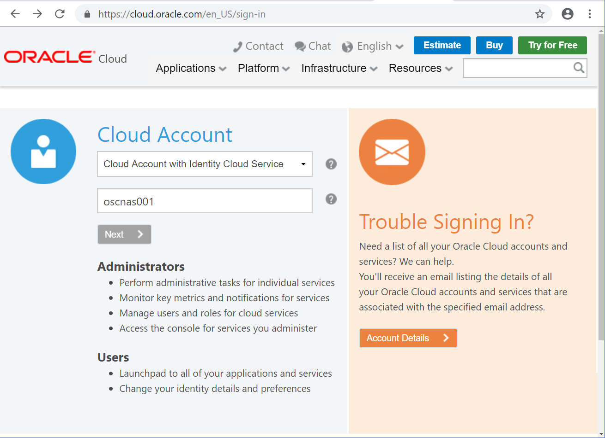
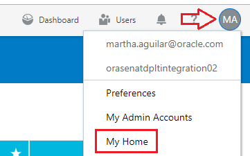
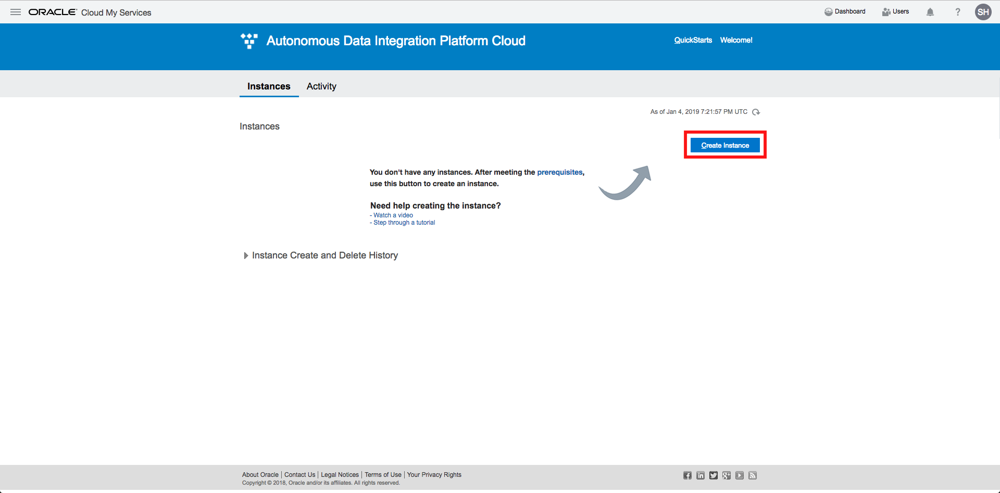
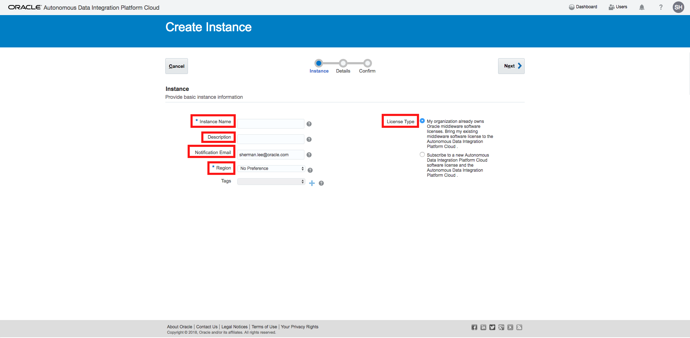

# Lab 100 -  Creating a Data Integration Platform Cloud Instance

## Before You Begin

### Introduction
Oracle Data Integration Platform Cloud (DIPC) simplifies your data integration by working with on-premises and cloud data source/targetss and accepting data in any shape or format. This lab will guide you on how to provision an instance of DIPC

### Objectives
- Provision a Data Integration Platform Cloud (DIPC) instance 

### Time to Complete
Approximately 30 minutes

### What Do You Need?
Your will need:
- Oracle Cloud URL
- Oracle Cloud User and Password

## Logging Into Oracle Cloud Instance

1. In your web browser, navigate to cloud.oracle.com, then click "Sign in".
2. Provide the cloud account; for example,oscnas001 then **\<Enter\>**

3. Provide your user name and password, then click "Sign In" button. You will land in your Home screen 

"My Oracle Services" screen (home screen) will come up and show you all the services you have access to.

If for any reason this screen does NOT come up:
1. Click on the circle with tyour user's initials located at the top right corner of your screen.
2. Then select "My Home".

## Creating an Oracle Data Integration Platform Cloud Instance

In this section, you create an Oracle Data Integration Platform Cloud instance using the instance creation wizard.

1. Scroll in your home screen until you locate "Data Integration Platform" service and click on it. 

2. In the Data Integration Platform Cloud console page, click the "Create Instance" button. 

3. Complete the Instance Information fields as follows, and then click the "Next" button:
    - Instance Name: DIPCABC
    - Description: Data Integration Platform Cloud for ABC instance
    - Notification Email: (a valid email address to receive provisioning status)
    - Region: Leave as No Preference
    - License Type: Choose the first option for Bringing Your Own License (BYOL)
    
4. Complete the Service Details fields as follows, and then click "Next":
    - Service Edition: Enterprise Edition
    - Data Volume - GB: 5GB data processed per hour 
    
5. Review your Data Integration Platform Cloud instance configuration details. If you need to make any changes, click "Previous" or use the navigation train to go back. Otherwise, click "CANCEL" button. **Please DO NOT Create!**, the instance creation process would normally take up to 30 minutes, so we have already created the instance in advance for the workshop.

## Summary
You have now successfully completed the Hands-on Lab, and reviewed the requirements and necessary steps to provision a Data Integration Platform Cloud (DIPC) instance.