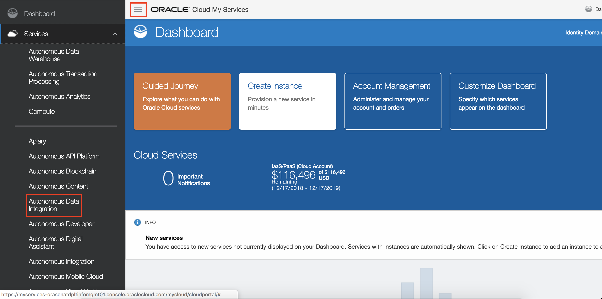

# Lab 100 -  Creating a Data Integration Platform Cloud Instance

## Before You Begin

### Objectives
- Provision a Data Integration Cloud Service instance (DIPC). 

### Time to Complete
Approximately 30 minutes, not including wait time for service activations.

### What Do You Need?
Your will need:

- Oracle Cloud URL
- Oracle Cloud User and Password
- General understanding of RDBMS and data integration concepts

## Logging Into Oracle Cloud Instance

1. In your web browser, navigate to cloud.oracle.com, then click Sign in.
2. Provide the cloud account: for example XXXXXXXXX then <Enter>

3. Provide your user name and password, then click Sign In. 

Click Services or Go to Dashboard to access My Oracle Services.

## Creating an Oracle Data Integration Platform Cloud Instance

In this section, you create an Oracle Data Integration Platform Cloud instance using the instance creation wizard.

1. Select the hamburger menu button on the top left corner. Locate "Data Integration" in your list of services, then select the service. 

2. In the Services page, click "Create Instance". 

3. Complete the Instance Information fields as follows, and then click the "Next" button:
    - Instance Name: DIPCABC
    - Description: Data Integration Platform Cloud for ABC instance
    - Notification Email: (a valid email address to receive provisioning status)
    - Region: Leave as No Preference
    - License Type: Choose the first option for Bringing Your Own License (BYOL)
    
4. Complete the Service Details fields as follows, and then click "Next":
    - Service Edition: Enterprise Edition
    - Data Volume - GB: 5GB data processed per hour 
    
5. Review your Data Integration Platform Cloud instance configuration details. If you need to make any changes, click "Previous" or use the navigation train to go back. Otherwise, click "CANCEL" button. **Please DO NOT Create!**, the instance creation process would normally take up to 30 minutes, so we have already created the instance in advance for the workshop.

## Summary
You have now successfully completed the Hands-on Lab, and reviewed the requirements and necessary steps to provision a Data Integration Platform Cloud (DIPC) instance.