# Lab 1000 - Replicate Date Elevated Task For Autonomous Data Warehouse
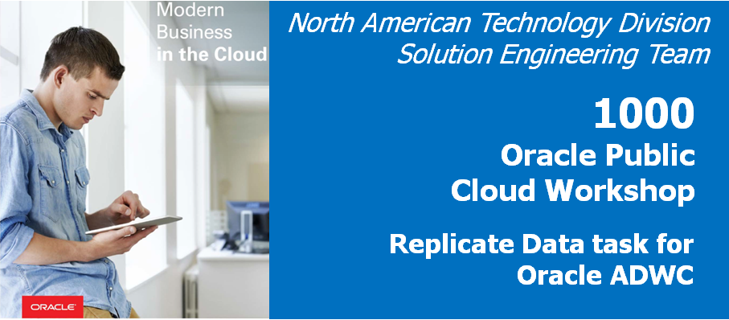

## Before You Begin

### Objectives
- Review how to create connections
- Review how to execute a Replicate Data elevated task for Autonomous Data Warehouse

### Time to Complete 
Approximately 60 minutes.

### What Do You Need?
Your will need:
- Oracle Managed DIPC Instance URL
- DIPC User and Password
- DB information for source system: server name, user/password and service name
- DB information for target system: client credentials file, admin user password and service names
- SQL Developer
- General understanding of RDBMS and data integration concepts

## Configure Oracle Autonomous Data Warehouse Cloud for Replication
In the Oracle Autonomous Data Warehouse Cloud database, complete the following tasks:

1. Oracle Autonomous Data Warehouse Cloud has a pre-existing database user created for Oracle GoldenGate called ggadmin. The ggadmin user has been granted the right set of privileges for Oracle GoldenGate Replicat to work. By default, this user is locked. To unlock the ggadmin user, connect to your Oracle Autonomous Data Warehouse Cloud database as the ADMIN user using any SQL client tool.

For example, in SQL Developer 18.3 and higher in the Connection Type field select the value Cloud Wallet that allows you to enter a credentials file. SQL Developer then presents a list of the available connections in the Service field (the connections are included in the credentials files).

If your application provides support for wallets or provides specific support for an Autonomous Data Warehouse connection,for example, Oracle SQL Developer, Oracle recommends that you use that type of connection.

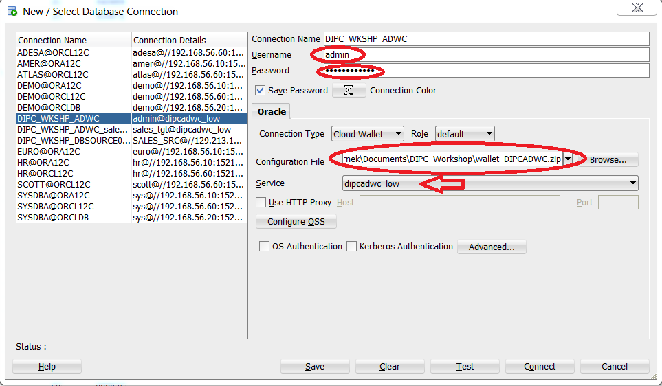

2. Run the alter user command to unlock the ggadmin user and set the password for it.
    ```
    alter user ggadmin identified by <password> account unlock;
    ```
3. Create the Target Schema for the data replication.
    ```
    create user sales_tgt identified by password;
    grant create session, resource, create view, create table to sales_tgt;
    ```
4. Connect to Oracle Autonomous Data Warehouse Cloud database as the sales_tgt user and create target tables for which DDL replication is not enabled

## Obtain Oracle Autonomous Data Warehouse Cloud client credentials file.
To establish connection to your Oracle Autonomous Data Warehouse Cloud database, you can download the client credentials file from the Oracle Autonomous Data Warehouse Cloud service console.

    ```
    Note: If you do not have administrator access to Oracle Autonomous Data Warehouse Cloud, you should ask your 
    service administrator to download and provide the client credentials file to you.
    ```
1. Log into your Oracle Autonomous Data Warehouse Cloud account.
2. From the Instance page, click the menu option for the Oracle Autonomous Data Warehouse Cloud instance and select Service Console.
3. Log into the service console using the admin username and its associated password.
4. In the service console, click the Administration tab.
5. Click Download Client Credentials.
6. Enter a password to secure your client credentials file and click Download.
7. Save the client credentials file to your local system.

The client credentials file contains the following files:
- cwallet.sso
- ewallet.p12
- keystore.jks
- ojdbc.properties
- sqlnet.ora
- tnsnames.ora
- truststore.jks

You refer to the sqlnet.ora and tnsnames.ora files while configuring Oracle Data Integration Platform Cloud to work with Oracle Autonomous Data Warehouse Cloud.

## Configure Oracle Data Integration Platform Cloud for replication.
Complete the following tasks in the system where ADIPC agent which will be used to connect to ADWC in configured, In this Lab we will be using a compute instance COMPUTE_DIPC01 to configure the DIPC agent:

1. Transfer the client credentials file that you downloaded from Oracle Autonomous Data Warehouse Cloud to your compute instance

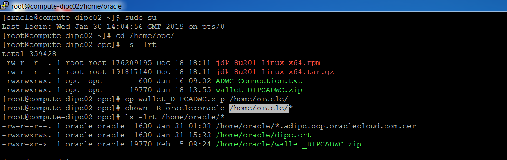

2. In the compute instance, unzip the client credentials file into a new directory. For example, /home/oracle/adwc_credentials. This will be your key directory

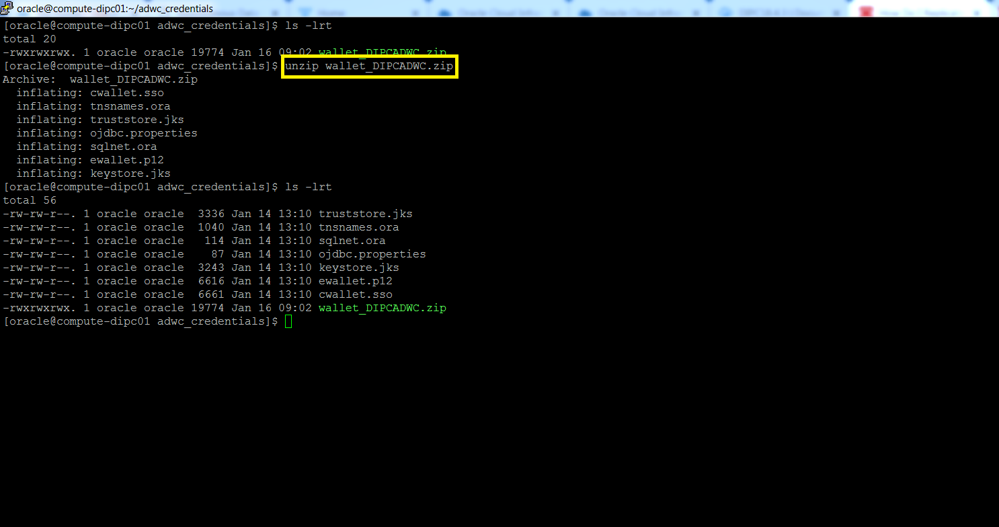

3. To configure the connection details, We need to create the tns files in the DIPC agent. Copy sqlnet.ora and tnsnames.ora files from the client credentials to /home/oracle/dicloud/oci/ location

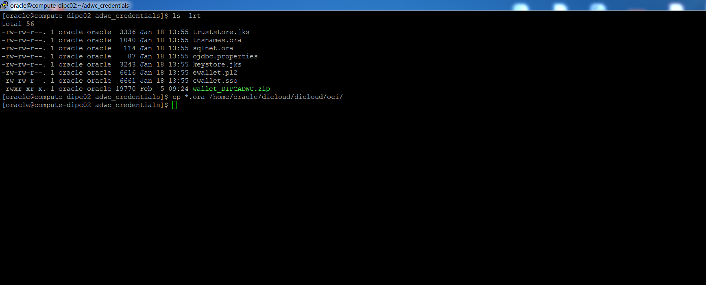

4. Edit the tnsnames.ora file in the /home/oracle/dicloud/oci/ location to include the connection details that is available in the tnsnames.ora file in your key directory (the directory where you unzipped the client credentials file downloaded from Oracle Autonomous Data Warehouse Cloud).

```
Note: The tnsnames.ora file provided with the client credentials file contains three database service names 
identifiable as:
ADWC_Database_Name_low
ADWC_Database_Name_medium
ADWC_Database_Name_high

For Oracle GoldenGate replication, use ADWC_Database_Name_low
```

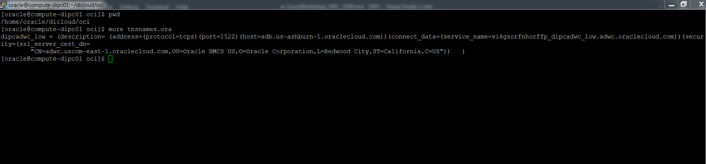

5. Edit this sqlnet.ora file to include your key directory.

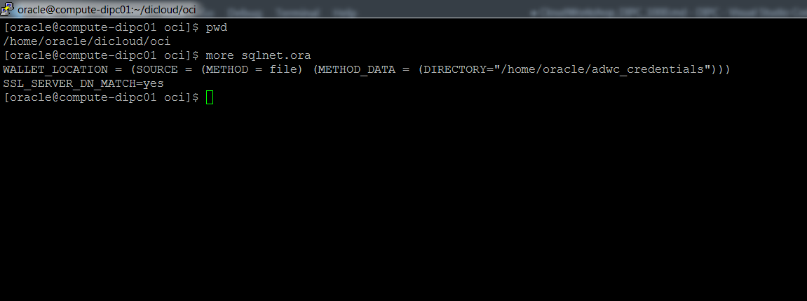

## Log into DIPC Server

### Login into DIPC using Oracle Cloud Services Dashboard

1. In your web browser, navigate to cloud.oracle.com, then click Sign in.

2. Provide the cloud account: orasenatdpltintegration02 then **{Enter}**

3. Provide your user name and password, then click "Sign In" button Or You can log in with Oracle SSO. You will land in the Dasboard screen.


4. In the Dasboard search for  "Autonomous Data Integration Platform Cloud" and click on the service.
 
 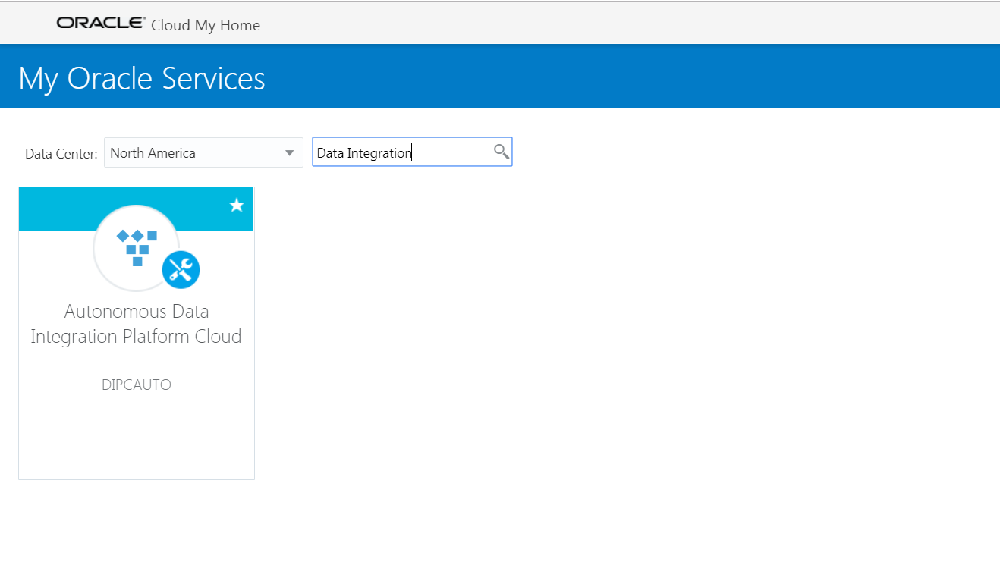

5. Click on the hamburger menu of the DIPC server assigned to you, then click "Data Integration Platform Console" ![]

 

You will be navigated to your DIPC server Home page. 

### Login into DIPC using direct URL

1. Open a browser window an provide your DIPC server URL. The URL will be provided by the instructor and will look like this one "https://dipc01-orasenatdpltintegration02.adipc.ocp.oraclecloud.com/dicloud".

2. Provide your user name and password, then click "Sign In" button 
You will be navigated to your DIPC server Home page.


## Create Connections and Review Catalog

1. Log into your Workshop DIPC Server.

2. For synchronization jobs we will need a CDB (Container DB) connection to our DB. In the Home Page click the “Create" button in the "Connection” box from top section. 

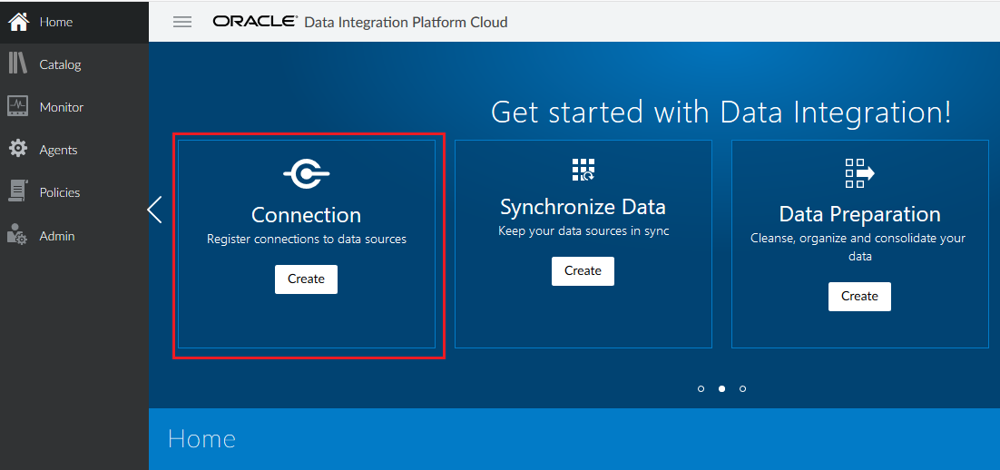

3.	Enter the following information
    - Name: SRC_CDB
    - Description: CDB User for Source DB
    - Agent: **{LOCAL_AGENT}**
    - Type: Oracle CDB
    - Hostname: **{SOURCE_DB_NAME}**
    - Port: 1521
    - Username: C##GGSRC
    - Password: Wel_Come#123
    - Service Name: **{CDB_SOURCE_SERVICE_NAME}**

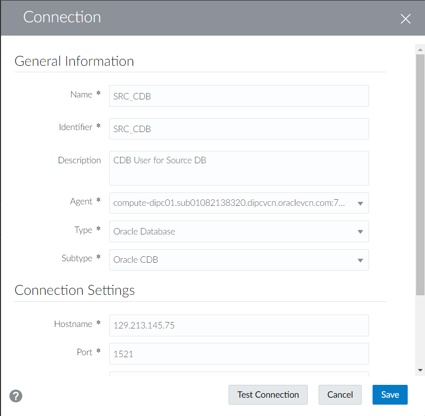 

    ```
    where:
        {LOCAL_AGENT} - Select the local DIPC agent 
        {SOURCE_DB_NAME} - Name of the source database server. This have been provided in your environment page; 
        look for entry SOURCE_DB_NAME
        {CDB_SOURCE_SERVICE_NAME} - CDB Service name string for the source database server. This have been provided
        in your environment page; look for entry CDB_SOURCE_SERVICE_NAME
    ```
4. Click "Test Connection" button and when the test is successful click "Save" button.

5. Open the drop-down menu from the top far right corner and then select “Connection”. 

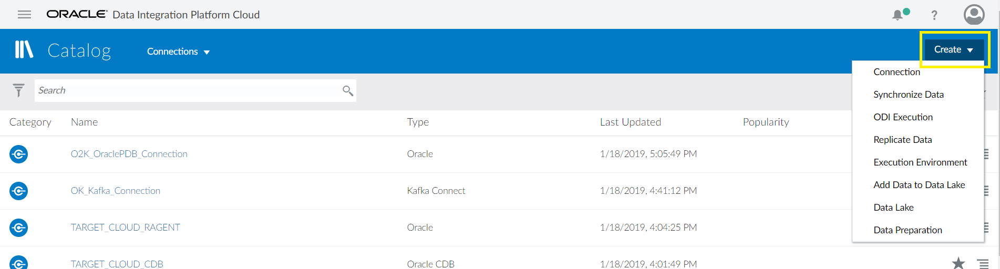

6. Enter the following information:
    - Name: SALES_SRC
    - Description: Sales OLTP Source Data
    - Agent: **{LOCAL_AGENT}**
    - Type Oracle: selecting Oracle will expand the Connection Settings 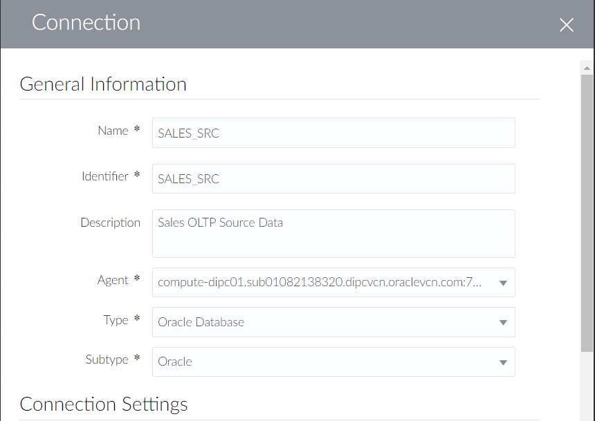
    - Hostname: **{SOURCE_DB_NAME}**
    - Port: 1521
    - Username: SALES_SRC
    - Password: Wel_Come#123
    - Service Name: **{SOURCE_DB_SERVICE_NAME}**
    - Schema Name: SALES_SRC (Default) – When you try to select the schema, you are testing the connection at the same time
    - CDB Connection: SRC_CDB 
    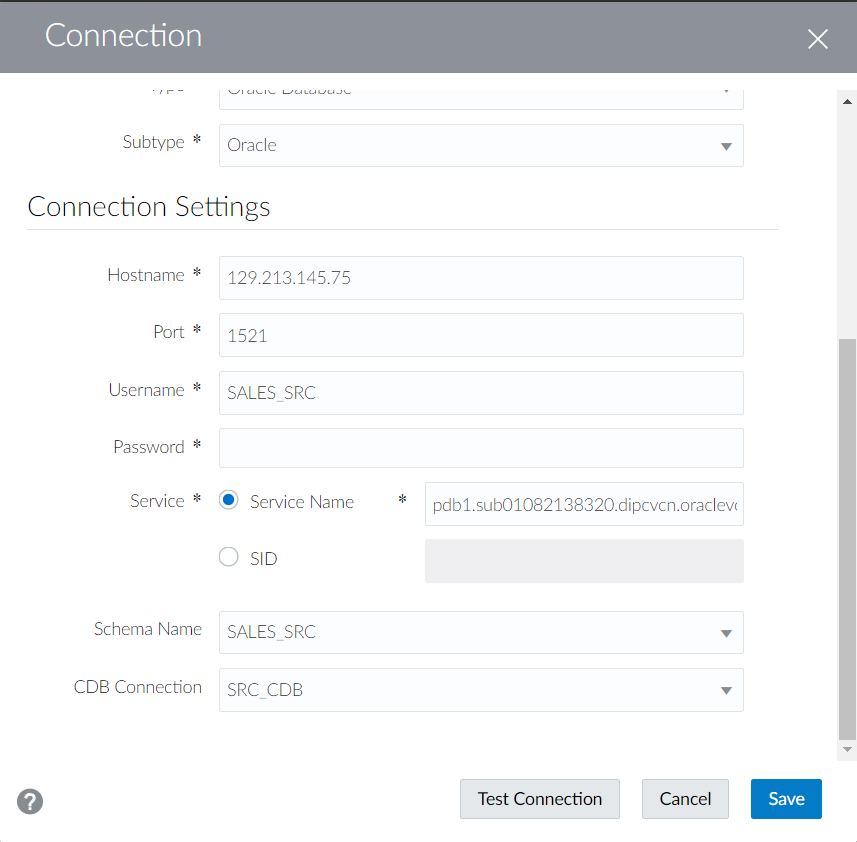
    ```
    where:
        {LOCAL_AGENT} - Select the local DIPC agent 
        {SOURCE_DB_NAME} - Name of the source database server. This have been provided in your environment page;
        look for entry SOURCE_DB_NAME
        {SOURCE_DB_SERVICE_NAME} - Service name string for the source database server. This have been provided 
        in your environment page; look for entry SOURCE_DB_SERVICE_NAME
    ```
7. Click "Test Connection" button and when the test is successful click "Save" button. DIPC will create the connection and will harvest the entities in the schema. You will be navigated to the Catalog and you will see, after some time, the connection you just created and the entities in that schema
    
    **Note: Data Entities are harvested and profiled at the time the connection is created, their popularity is also calculated by reviewing the DB query logs. This process may take some time (5 minutes or so), the Catalog will show a message when new updates are available**

    

8.	Now, we are going to create the target connection for Autonomous Data Warehouse. Open the drop-down menu from the top far right corner and then select “Connection”  

9.	Enter the following information:
    - Name: ADWC_TGT 
    - Description: Connection for ADWC Target
    - Agent: **{LOCAL_AGENT}**
    - Type : Oracle Autonomous Data Warehouse Cloud
    - Username: ggadmin 
    - Password: Wel_Come#123
    - Credential File : **{Upload the creadential file downloaded}**
    - Connection URL : **{Select from drop down}**
    - Service Name: dipcadw_low
    - Schema Name: SALES_TGT  (Default)
    ```
    where:
        {LOCAL_AGENT} - Select the local DIPC agent 
              
    ```
    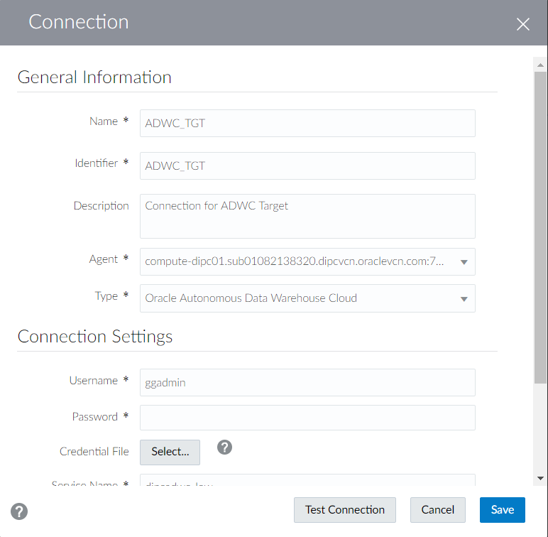

10. Click "Test Connection" button and when the test is successful click "Save" button. DIPC will create the connection and will harvest the entities in the schema. You will be navigated to the Catalog and you will see, after some time, the new connection you just created and the entities in that schema (if any)


## Create Replicate Data Elevated Task
1.	Connections have been defined. We are ready to create and execute our “Synch Data” elevated task. From the top bar, open the drop-down menu from the top far right corner and then select “Synchronize Data” 
 
2.	Provide the following information:
    - Name: Sync Sales Data
    - Description: Sync Schemas - SALES_SRC to SALES_TRG  
    - Source – Connection: SALES_SRC
    - Source – Schema: SALES_SRC – The default schema will be automatically selected. Leave it
    - Target – Connection: SALES_TRG 
    - Target – Schema: SALES_TRG  – The default schema will be automatically selected. Leave it
    - Advanced – Include Initial Load: SELECTED
    - Advanced – Include Replication: SELECTED
    The “Advanced Options” allow you to optionally enable or disable the initial load and/or the on-going schema replication.
    **Note: If you run into any issues when trying to select a Connection refresh the page manually. The Schemas may take some time to appear as well, this is expected.**
    
3.	Next click on “Configure Entities” on the top bar to filter the objects that will be transferred from source into target. 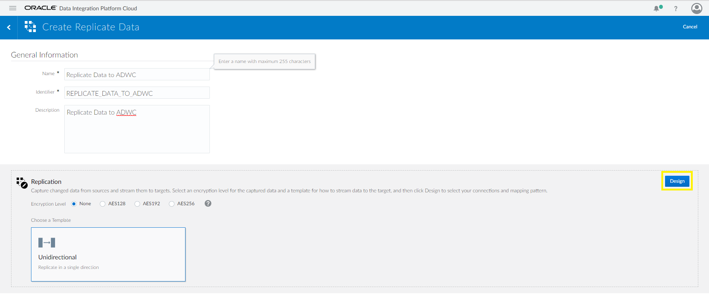
4.	The “Configure Entities” screen allows you to create include or exclude rules to define precisely which database objects will be moved over to the target schema. By default, all data entities are transferred. Enter SRC_C* in the "Rules" field and click on “-” button. 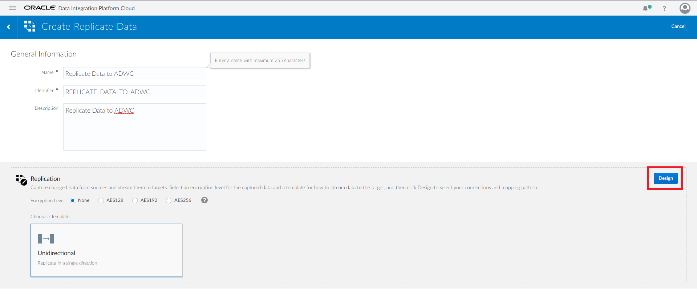  
5.	Please note how the "Selected Data Entities" list changes when the rule is applied. Select the hamburger menu   (located on the right side of the row) of the rule you just created and select “Delete". You should end up with the original rule only
6.	Click on “Save & Run” button on the top right to execute the task 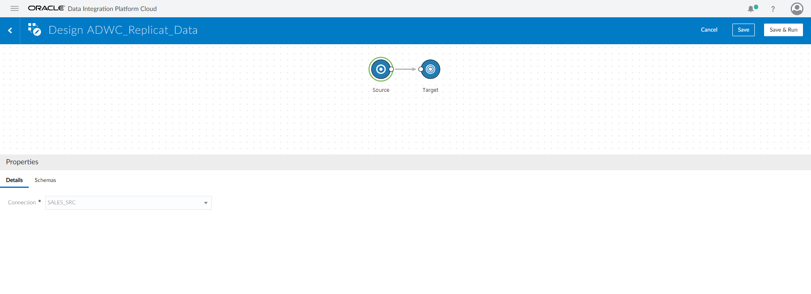
7.	A message will appear in the notification bar and you will be navigated to the “Monitor” screen. 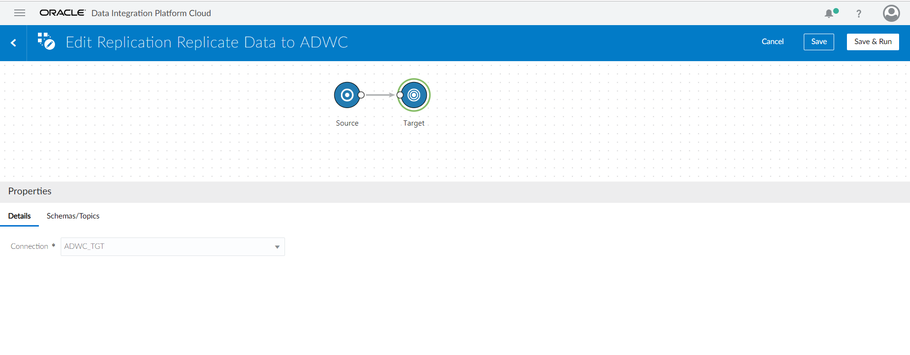
8.	The job will automatically appear within the Jobs page. This may take some time 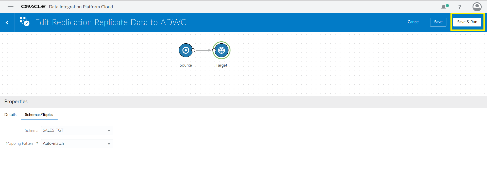 
Auto-refresh is on, statuses will be updated frequently.
As the job executes, the Initial Load process is created in ODI while DIPC configures OGG for the Source Capture and Target Delivery.


## Review Task Execution

### In ODI Console (Optional)
The Initial Load process uses Data Pump and can be monitored within ODI Console. 

1.	Click on the picture icon located on the top right corner of the screen and then select “Open ODI” 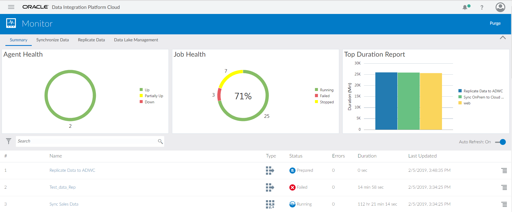  
2.	Click on “Proceed” button   
3.	On the hierarchical panel on the left select “Runtime > Sessions > Sessions”. Then select the row. 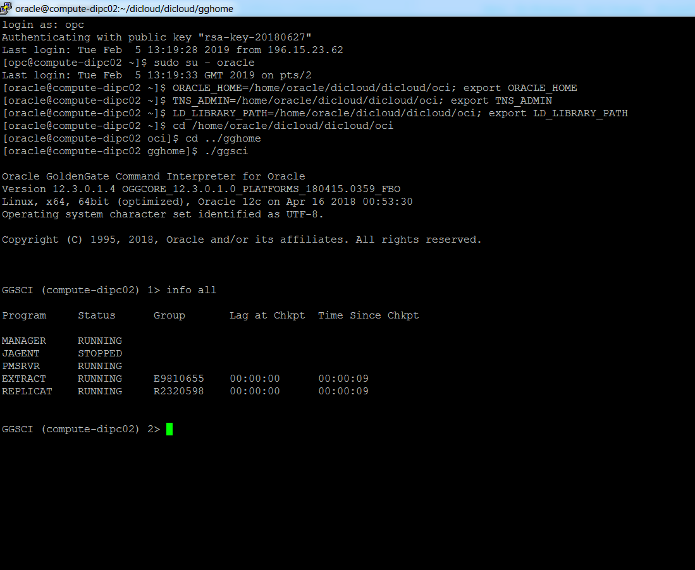
4.	Now click on the “View” icon (sunglasses located on top left corner). This will open a tab on the right side with information about the executed sessions. 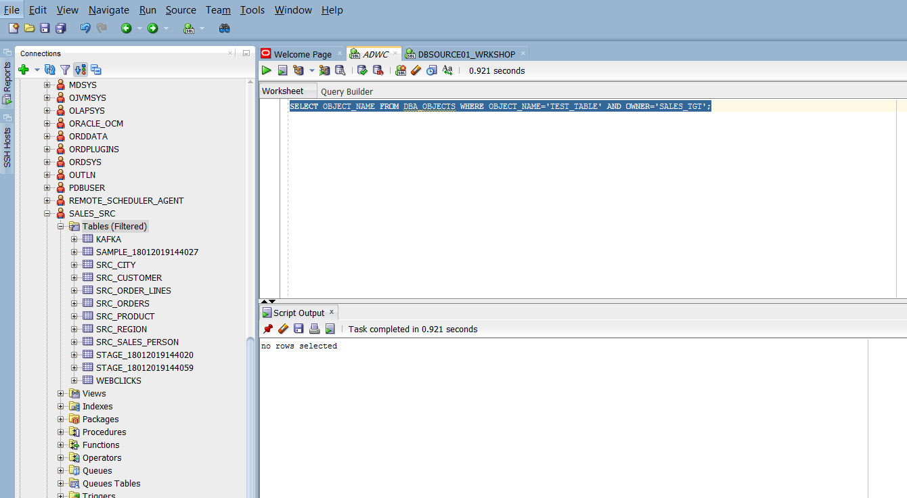
5.	Click on the session name to drill down and look at more detail 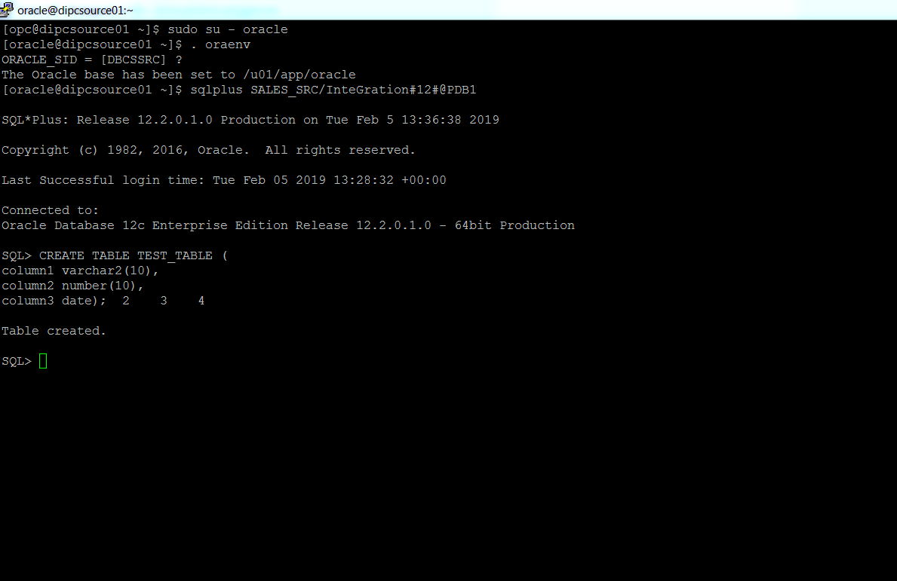
6.	Scroll down to see the detailed steps. When finished, you can close the browser tab with ODI Console 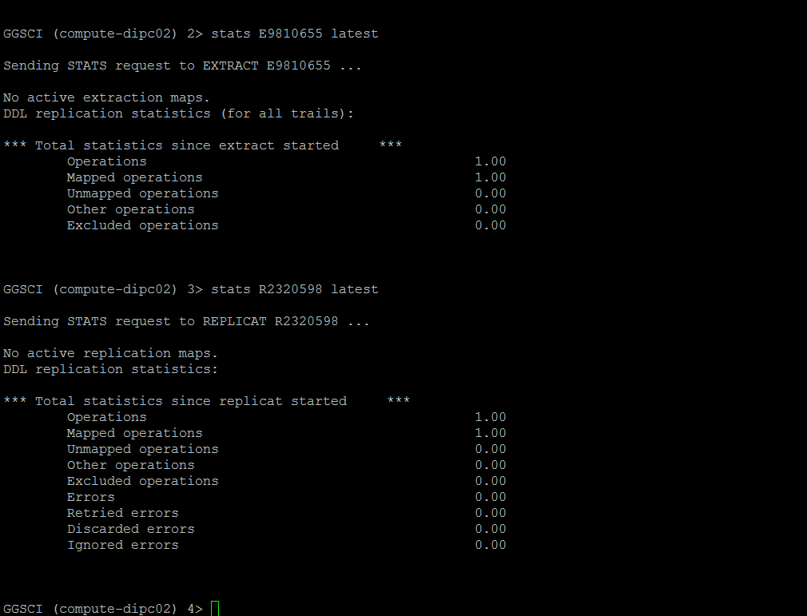


### Review Job in DIPC
1.	You should be in the “Jobs” screen. Click on the Job to see the Job Details. The Initial load Action will show Successful after a little while
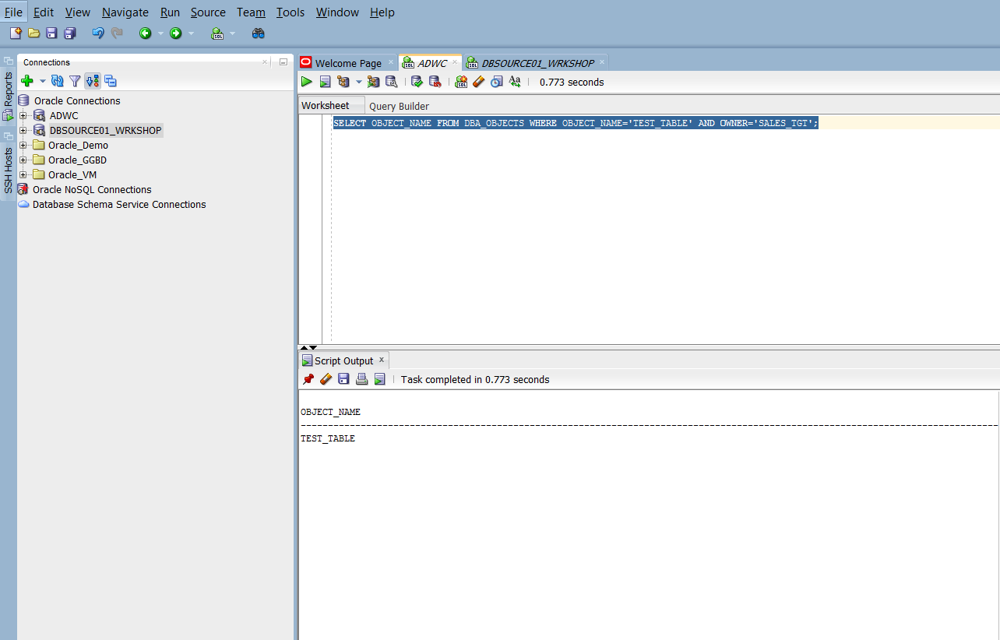 
2.	Once done, the “Initial Load” Action can be expanded to review the various steps underneath
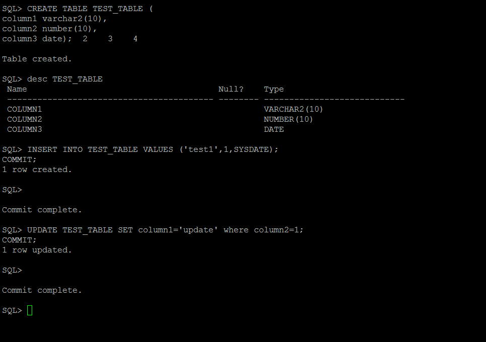 
3.	Click on “Procedure:Initial load_PROC:DBLINK_DATAPUMP” to review the code generated by DIPC for the Initial Load. 
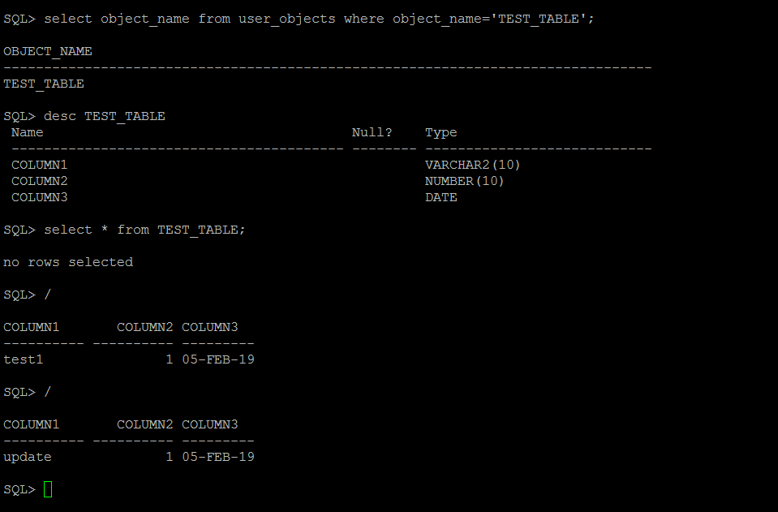 
4.	Click Done when you’ve completed the code review
5.	Close “Initial Load” action. Let’s review what else has been created. You should see 5 Actions
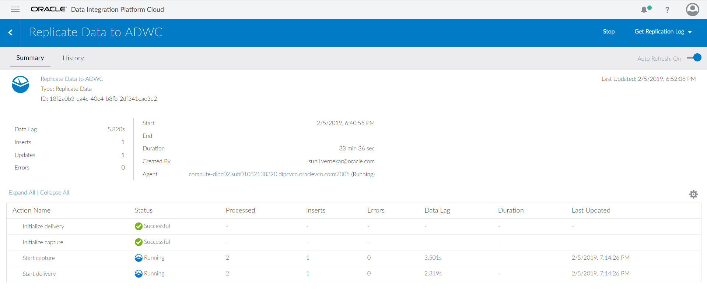
DIPC has created and orchestrated the initial load and the data synchronization processes between the source (for example, an OLTP system) and the target (for example, an operational data store, stand-by copy, etc.) -- (additional details can be seen in the GG logs as well as within ODI Studio)


### Verify Data in Source and Target DBs (Optional)
Up until this point, we have monitored the job within DIPC but it would nice to see the data in both source and target to verify that they are the same. For such task, we will use SQL Developer; please refer to Appendix 3 to learn how to create connections against the workshop databases.
1.	Start SQL Developer. On the connections panel, select your source database (WS - SALES_SRC) and click on the plus (+) sign to open the connection 

2.	Once opened, copy and paste the following statements in the panel on the right:
    ```
    SELECT COUNT(*) AGE_GROUP FROM SRC_AGE_GROUP;
    SELECT COUNT(*) CITY FROM SRC_CITY;
    SELECT COUNT(*) CUSTOMER FROM SRC_CUSTOMER;
    SELECT COUNT(*) ORDER_LINES FROM SRC_ORDER_LINES;
    SELECT COUNT(*) ORDERS FROM SRC_ORDERS;
    SELECT COUNT(*) PRODUCTS FROM SRC_PRODUCT;
    SELECT COUNT(*) REGION FROM SRC_REGION;
    SELECT COUNT(*) SALES_PERSON FROM SRC_SALES_PERSON;
    ```

3.	Execute the statements by clicking on the “Run script” icon (second icon from left to right on the icon bar; right-ponting green arrow head on top of a page)
4.	This will show all entities count on the results panel (lower section) 

5.	Repeat steps 1 through 4 for connection “WS - SALES_TRG ”     

This will show that the count in both data bases is exactly the same.


### Verify GG processes (Optional)
If you want to take a look and verify that the GG processes (extract and replicat) are running, these are the steps:

1.	Open an SSH session into the DIPC server; please refer to Appendix 1 to learn how to establish a SSH session against the DIPC server
2.	Execute: source .ggsetup 
3.	Execute: /u01/app/oracle/suite/gghome/ggsci 
4.	You are now in GG console, execute: info all 
Now you have verified that both Extract and Replicat are running. Exit from GGSCI


## Monitor Data Changes 

We are going to apply some changes to the source DB and verify how our “Synchronize Data” task takes care of these changes and replicates them to the target.

1.	Go to your SQL Developer and expand “WS - SALES_SRC” connection and its tables.

2.	Select “SRC_CUSTOMER” table
3.	On the right panel, select “Data” tab

4.	Click on “Insert Row” icon and provide the following data:
    - CUSTID: 1000
    - DEAR: 0
    - LAST_NAME: Parker
    - FIRST_NAME: Peter
    - ADDRESS: 11000 Smith Street
    - CITY_ID: 12
    - PHONE: (510) 556 4879
    - AGE: 48
    - SALES_PERS_ID: 12 
5.	Click on “Commit” icon to insert the row into the DB (fifth icon from left to right on the icon bar; green checkmark on top of a disk)
6.	Verify the insert in the target. Go to SQL developer and expand “WS - SALES_TRG ” connection and its tables 
7.	Select “SRC_CUSTOMER”  table
8.	On the right panel, select “Data” tab. You will need to scroll all the way down to see the new row 
As data is updated, inserted or deleted from the source the data will be automatically synchronized with the replicated schema by the DIPC Sync Sales Data Job. 
9.	Go back to DIPC, you should be in the detail screen of the Data Synch job
10.	Verify that the screen has auto refresh ON so you will see the changes 
11.	It might take some time. The screen will reflect the insertion in the source 
12.	And the insertion in the target 
13.	Now, we will perform a delete. On your “WS - SALES_SRC” connection (SQL Developer) select “SRC_CUSTOMER” table
14.	On the right panel, select “Data” tab and look for “Peter Parker”, select it.

15.	Click on “delete icon (fourth icon from left to right on the icon bar; red X) 
16.	Click on “Commit” (fifth icon from left to right on the icon bar; green checkmark on top of a disk) icon 
17.	Let’s verify the deletion in the target. On your “WS - SALES_TRG ” connection (SQL Developer) select “SRC_CUSTOMER” table
18.	Look for “Peter Parker”, it will not be there
19.	Go back to DIPC, you should be in the detail screen of the Data Synch job
20.	It might take some time. The screen will reflect the deletion in the source 
21.	And the deletion in the target 
22.	Now let’s perform an update. On your “WS - SALES_SRC” connection (SQL Developer) select “SRC_CUSTOMER” table
23.	On the right panel, select “Data” tab and look for “Paul Brendt”, double click in his age 
24.	Change it to 25 
25.	Click on “Commit” (fifth icon from left to right on the icon bar; green checkmark on top of a disk) icon. This row will be automatically updated on the target as the DIPC Job picks up the change
26.	Let’s verify the update in the target. On your “WS - SALES_TRG ” connection (SQL Developer) select “SRC_CUSTOMER” table
27.	On the right panel, select “Data” tab and look for “Paul Brendt”, his age has change to 25
28.	Go back to DIPC, you should be in the detail screen of the Data Synch job
29.	It might take some time. The screen will reflect the update in the source 
30.	And the update in the target 


## Summary
You have now successfully completed the Hands-on Lab, and have successfully performed an end-to-end data synchronization task through Oracle’s Data Integration Platform Cloud.


Using DIPC for replicating to ADWC
https://docs.oracle.com/en/cloud/paas/data-integration-platform-cloud/using/replicate-data-oracle-autonomous-data-warehouse-cloud.html
