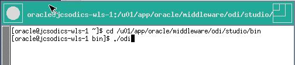
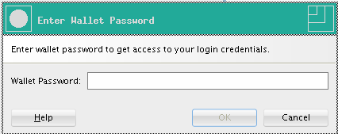
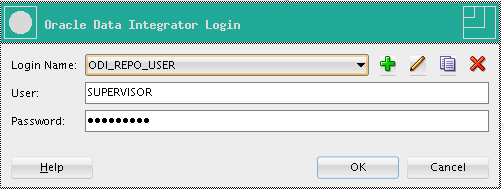

# Lab 900 - MySQL integration

## Before You Begin

### Purpose
This lab shows how to show the power of the individual "engines" that are part of DIPCS. DIPCS is powerful on its own but this power is increased with the possibility of accessing and working directly with the "engines" underneath.

### Time to Complete 
GG: Approximately ** minutes
ODI: Approximately ** minutes
EDQ: Approximately 90 minutes

### What Do You Need?
Your will need:
- DIPC Instance URL
- DIPC User and Password
- SSH acces to DIPC server
- VNC viewer to establish a graphic session against DIPC server
- General understanding of data quality

## GoldenGate (GG)

## Oracle Data Integration (ODI)

### Accessing ODI Studio
1.	Open an SSH session into the DIPC server; please refer to Appendix 1 to learn how to establish a SSH session against the DIPC server
2.	Open a VNC viewer; please refer to Appendix 2 to learn how to establish a VNC session against the DIPC server
3.	Open a terminal; select “Applications > System Tools > Terminal” from the top left corner of the screen
 

4.	Execute: sh /u01/app/oracle/suite/odi_studio/odi/studio/bin/odi 

5.	ODI Studio will come up. Click on “Connect to Repository…”

6.	Use login “ODIStudio”. Click on “OK” button

7.	You are now in ODI Studio

