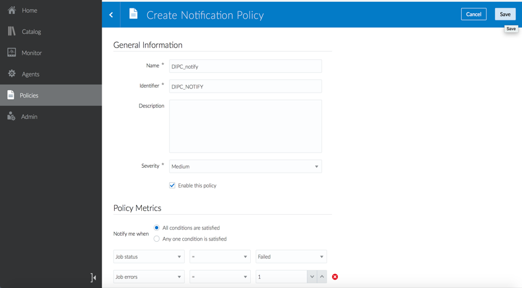
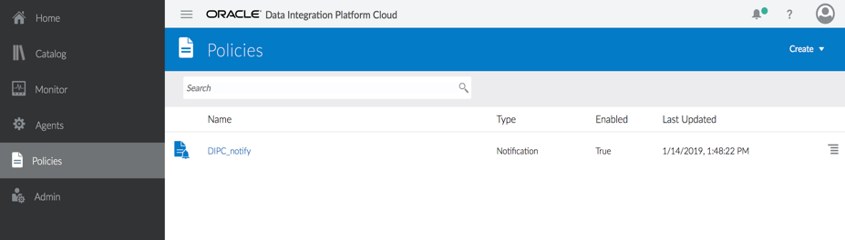

# Lab 1100 - Monitor Jobs / Policies

Before You Begin
----------------

### Objectives

-   Monitor Jobs
-   Create Policies

### What Do You Need?

Your will need:

-   DIPC Instance URL

-   DIPC User and Password

-   You must have Tasks and Jobs running.

## Monitor Jobs
------------

The Monitor page displays information about all the Jobs ever started in
Data Integration Platform, whether they\'re running or stopped, already
finished successfully or failed.

1.  Log into your DIPC server, provide the URL (it should look like
    this): https://dipc01-orasenatdpltintegration02.adipc.ocp.oraclecloud.com/dicloud/app/index.html

2.  Provide your user name and password, then click \"Sign In\" button.
    
    Or, if you are already in the application, go to the \"Home\" page by selecting the \"Home\" hyperlink from the left panel.

3.  In the Home Page click on \"Monitor\" located at the left side.
    

4.  This page will hold Summary for all the jobs, and then pages for
    these three specific types of jobs created from these tasks:
    Synchronize Data, Replicate Data and Data Lake Management. Each of
    these pages has three tiles and a table:
    

    a.  Agent Health

        This tile reports whether capture and delivery plugins related
        to Oracle Data Integration Platform Cloud tasks are running on the
        data sources or not which is different from the status of the agents
        displayed on the Agents page.

    b.  Job Health

        The Job Health tile located in the Monitor page of Oracle Data
        Integration Platform Cloud displays information for all the Jobs
        ever run on the server.

    c.  Top Duration Report

        The Top Duration tile in the Summary page of Monitor displays the
        top three jobs with the longest duration. Duration of a job is the
        job's end time minus its start time.

    d.  Top Data Report

        This tile displays the top three Jobs with highest throughput in the
        past three days. Throughput is the number of operations replicated
        in the past three days in Megabytes/second.

    e.  Top Lag Report

        This tile displays the top three running Jobs with the most lag. The
        replication lag is calculated as difference in seconds between the
        time that a record was processed in the target and the timestamp of
        that process received through Data Integration Platform Cloud\'s
        running agents on the source.

## Create Policies
-----------------

Policies enable you to specify conditions for when and how often a job
should run and when you should be notified.

Policies are a set of conditions for job activities. If the conditions
are met, a job will execute or you'll receive a notification. You're
alerted to new notifications within the Data Integration Platform
Cloud console. The alert icon at the top of the page displays the number
of new notifications you have.

### Creating a New Notification Policy

A Notification is an alert that you receive in Data Integration Platform
Cloud when Notification Policy conditions are met.

A notification is an alert you get about one of your jobs when certain
Notification Policy conditions are met. To view your notifications,
click the **Notifications** icon, displayed as a bell, accessible from
any page in your Data Integration Platform Cloud console.

1.  On the Policies page, click **Create**, and then
    select **Notification Policy**.
    

2.  On the Create Notification Policy page, complete the General
    Information fields as needed.
    

3.  For Severity, select the importance of your notification:
    **Low**, **Medium**, or **High**.

4.  Click **Enable this policy** to activate it.

5.  Under Policy Metrics, select when you should be notified, either
    when **All conditions are satisfied** or when **Any one condition is
    satisfied**, and then set the conditions:

    a.  Select a metric.

    b.  Select an operator.

    c.  Select or specify a value.

6.  Click **Save**.

7.  After you save your policy, it\'s listed on the Policies page where
    you then edit or delete it from its **Show Context menu**.
    

### Create a new Scheduling Policy

A Scheduling Policy sets the conditions for when and how often a job
should run in Data Integration Platform Cloud.

To create a Scheduling Policy:

1.  On the Policies page, click **Create**, and then select **Scheduling
    Policy**.
    

2.  On the Create Scheduling Policy page, complete the General
    Information fields as needed.
    

3.  Select the **Task** from the dropdown menu.

4.  Click **Enable this policy** to activate it.

5.  Under Scheduling Information:

    a.  Select how often you want the job to run from
        the **Frequency** menu.

    b.  Set the **Start Date** and **End Date** values.

6.  Click **Save**.

After you save your policy, it\'s listed on the Policies page where you
then edit or delete it from its **Show Context menu**.
