# Lab 1300 - Replicate Data - Oracle to Kafka
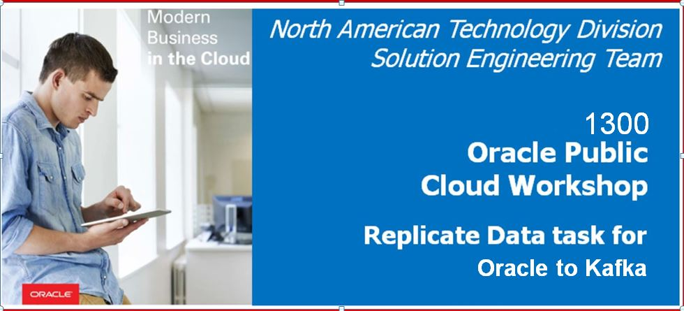

## Before You Begin

### Objectives
- Review how to create connections
- Review how to execute a Replicate Data Task between Oracle and Kafka

### Time to Complete 
Approximately 60 minutes.

### What Do You Need?
Your will need:
- Oracle Managed DIPC Instance URL
- DIPC User and Password
- DB information for source system: server name, user/password and service name
- Confluent Kafka Installation 
- General understanding of Kafka Processes and RDBMS 

## Configure Source Database (oracle) for Replication
In the Oracle database, complete the following tasks:

1. Create a Oracle 12c CDB database and inside it create a PDB. We need to have a Schema created for which we will configure the Replication. In this case we will use SALES_SRC Schema under PDB1. We will Replicate a table called as Kafka under SALES_SRC schema.

## Configure Destination (Kafka) for Replication
1. Install Confluent Kafka 5.1 on the target box. Kafka is basically a stream processing Software. Once the Installation is completed, Start the following processes within Kafka
(i) Zookeeper 
(ii) Kafka Server
(iii) Create Topics in kafka which will be used to store the Data coming from Oracle Database(Source)


## Configure Oracle Data Integration Platform Cloud for replication.
In this Lab we will be using a compute instance COMPUTE_DIPC01 to configure the DIPC agent:


## Log into DIPC Server

### Login into DIPC using Oracle Cloud Services Dashboard

1. In your web browser, navigate to cloud.oracle.com, then click Sign in.

2. Provide the cloud account: orasenatdpltintegration02 then **{Enter}**

3. Provide your user name and password, then click "Sign In" button Or You can log in with Oracle SSO. You will land in the Dasboard screen.


4. In the Dasboard search for  "Autonomous Data Integration Platform Cloud" and click on the service.
 

 

5. Click on the hamburger menu of the DIPC server assigned to you, then click "Data Integration Platform Console" ![]


 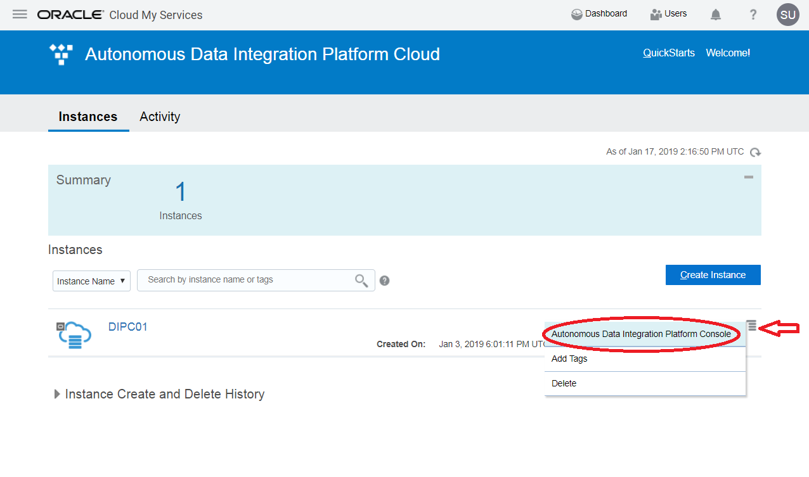


You will be navigated to your DIPC server Home page. 


## Create Connections For Oracle Database (Source) and Kafka(Target)
1. Log into your Workshop DIPC Server.
2. Navigate to Catalog tab and Click on Create and Select 'Connection'

 
 
3.	Enter the following information
    - Name: O2K_Oracle_Connection
    - Description: CDB User for Source DB
    - Agent: **{LOCAL_AGENT}**
    - Type: Oracle CDB
    - Hostname: **{SOURCE_DB_NAME}**
    - Port: 1521
    - Username: C##GGSRC
    - Password: Wel_Come#123
    - Service Name: **{CDB_SOURCE_SERVICE_NAME}**

        
    ```
    where:
        {LOCAL_AGENT} - Select the local DIPC agent 
        {SERVICE_NAME} - CDB Service name string for the source database server. 

    ```
4. Click "Test Connection" button and when the test is successful click "Save" button.

5. Create another Connection for PDB. Open the drop-down menu from the top far right corner and then select “Connection”. 

6. Enter the following information:
    - Name: O2K_ORACLEPDB_CONNECTION
    - Description: Replicate data from Oracle to Kafka
    - Agent: **{LOCAL_AGENT}**
    - Type: Oracle Database
    - Subtype - Oracle 
    - Hostname: **{SOURCE_DB_NAME}**
    - Port: 1521
    - Username: SALES_SRC
    - Password: Wel_Come#123
    - Service Name: **{SOURCE_DB_SERVICE_NAME}**
    - Schema Name: SALES_SRC (Default) – When you try to select the schema, you are testing the connection at the same time
    - CDB Connection: O2K_Oracle_Connection (This was created before)

    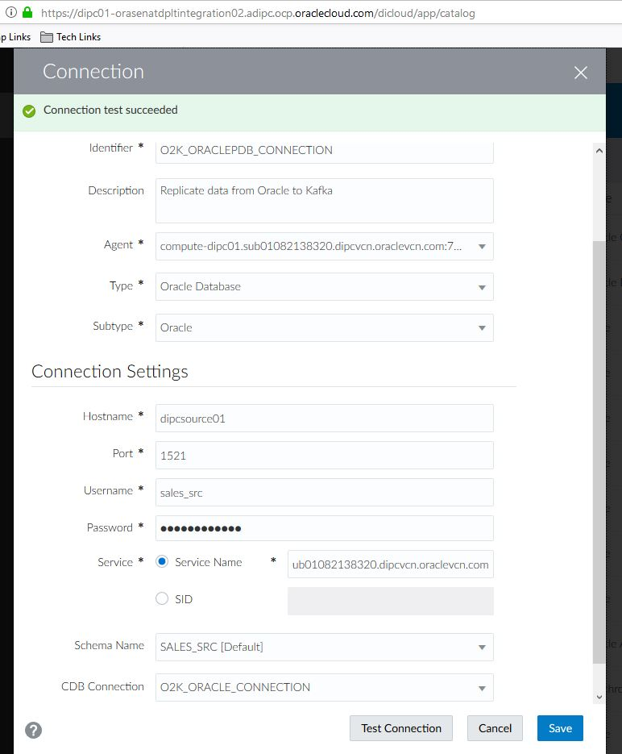
    ```
    where:
        {LOCAL_AGENT} - Select the local DIPC agent 
        {SOURCE_DB_SERVICE_NAME} - Service name string for the source database server. 

    ```
7. Click "Test Connection" button and when the test is successful click "Save" button. DIPC will create the connection and will harvest the entities in the schema. You will be navigated to the Catalog and you will see, after some time, the connection you just created and the entities in that schema
    **Note: Data Entities are harvested and profiled at the time the connection is created, their popularity is also calculated by reviewing the DB query logs. This process may take some time (5 minutes or so), the Catalog will show a message when new updates are available**
    

8.	Now, we are going to create the target connection (For Kafka). Open the drop-down menu from the top far right corner and then select “Connection”  


9.	Enter the following information:
    - Name: OK_Kafka_Connection 
    - Description: Relicate data from Oracle to Kafka
    - Agent: **{LOCAL_AGENT}**
    - Type Oracle – Kafka Connect
    - Kafka Producer Config file - kafkaconnect.properties
    - Topic Mapping Template: {FullyQualifiedTableName}
    - Key Mapping Template: {primarykeys} 
    - Java ClassPath: Confluent kafka Home path

    Leave all the checkboxes as default selection. Also Java ClassPath will be a combination of following :
    dirprm/:kafkaconnect.properties:{kafka_home}/share/java/kafka-serde-tools/*:{kafka_home}/share/java/kafka/*:{kafka_home}/share/java/confluent-common/*

    Where your Kafka home will be kafka Installation directory.

    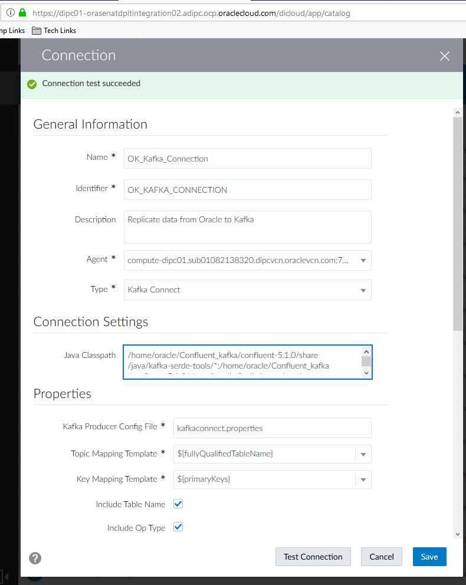

16. Click "Test Connection" button and when the test is successful click "Save" button. DIPC will create the connection and will harvest the entities in the schema. You will be navigated to the Catalog and you will see, after some time, the new connection you just created and the entities in that schema (if any)


## Data Replication Tasks
1.	Connections have been defined. We are ready to create and execute our replication tasks between Oracle and Kafka. From the top bar, open the drop-down menu from the top far right corner and then select "Replicate Data" 


2.	Provide the following information:
    - Name: O2K_Replication
    - Description: Oracle to Kafka Replication

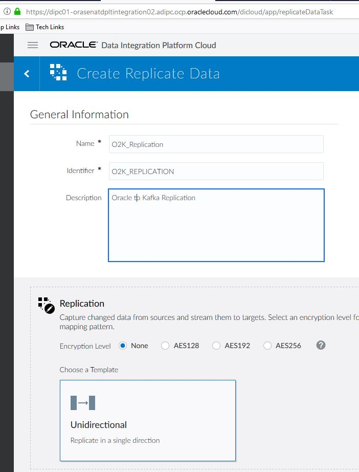

Click the Design Tab to start designing the Source and Target Functionalities

3.	Next click on “Source” and in the "Details" tab select the name of the PDB Connection that we had created. 

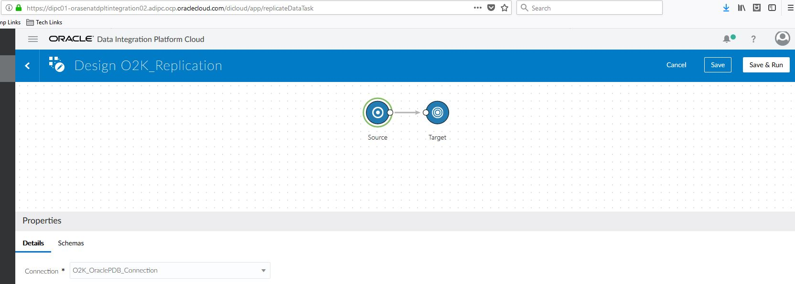

4.	Next Click the "Schemas" Tab and Select SALES_SRC Schema and in the Text Area append ".kafka" to it. You will notice that the bottom right corner #Rule Applied Confirmation.

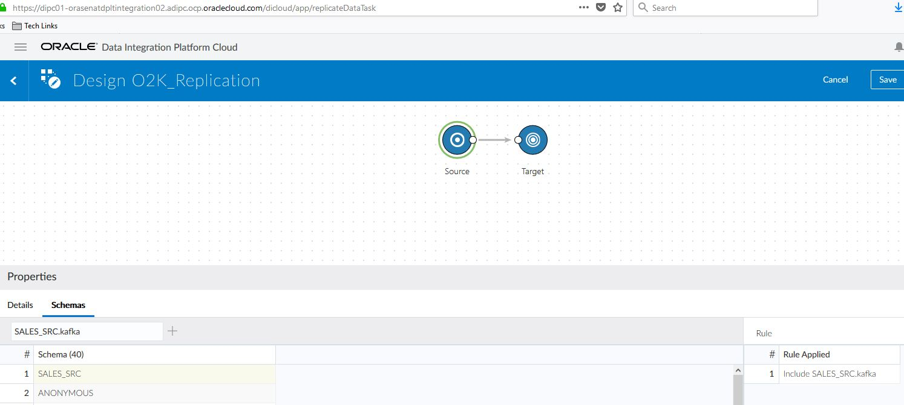  

5.	Next Click on the "Target"  and in the "Details" Tab select the Name of the Kafka Connection that we had created.

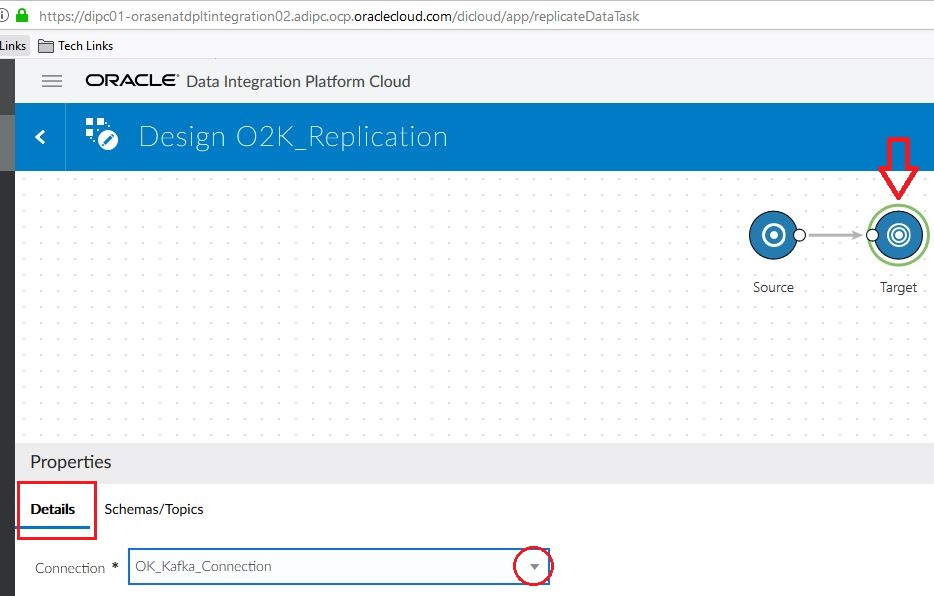

6.  Next Click the "Schemas" Tab and Leave the default values as it is. Once this is completed, Click on Save and Run at the upper Right corner of the Screen.

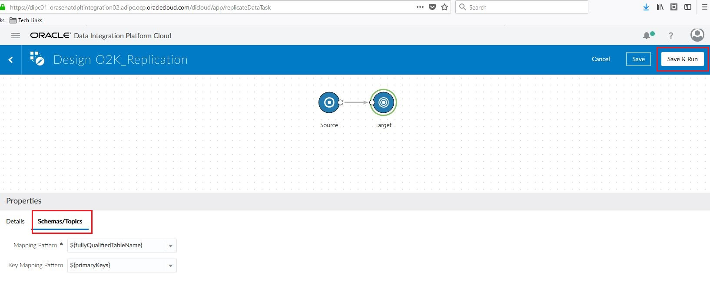

7.	The job will automatically appear within the Jobs page. It will be shown like this

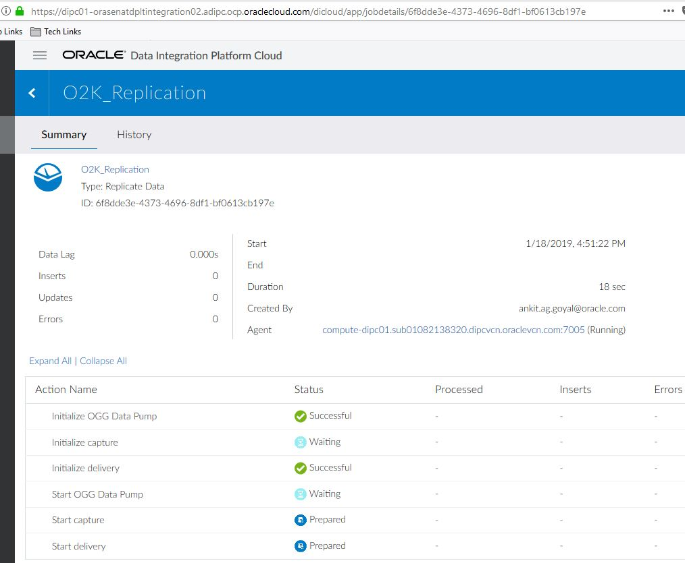


Auto-refresh is on, statuses will be updated frequently.


## Replicate Data Test Case Execution

1.	Login to The Source PDB Database, Create a table Kafka and Insert one Record in the table

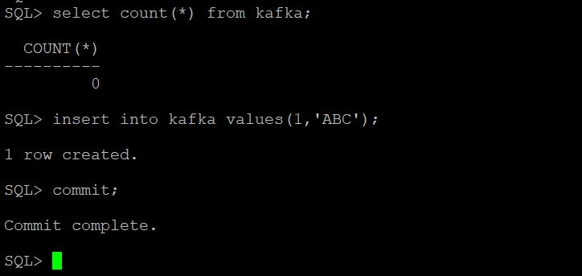

2.	Once the Data Inserted is Committed, you will see one Insert shown in your Job as below.

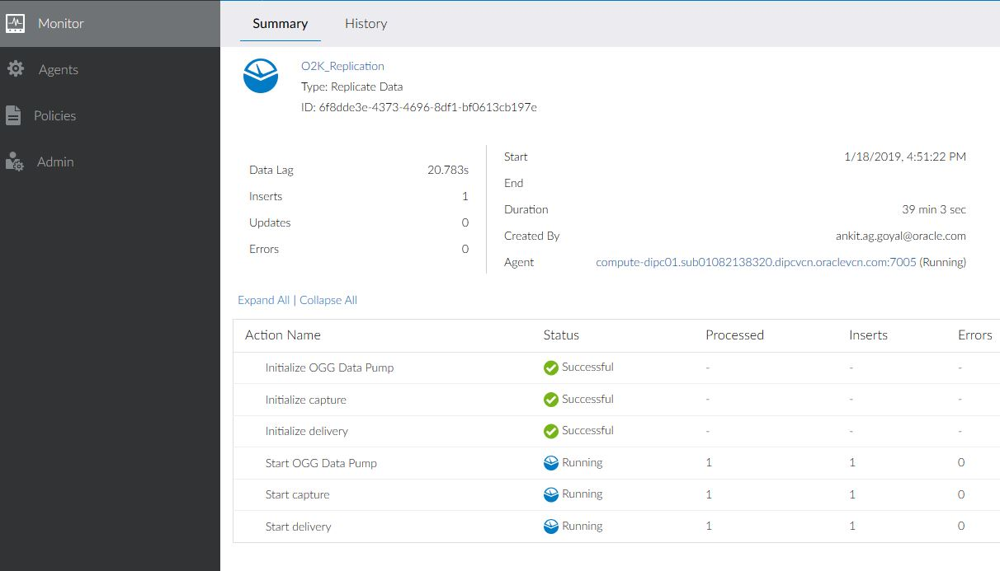 

3.	Login to the Kafka Server and Check the Data being listed on the Consumer. Note in the below screenshot, data is in JSON Format.

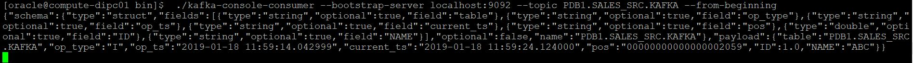


## Summary
You have now successfully completed the Hands-on Lab, and have successfully performed an Data Replication between Oracle Database as Source and Confluent Kafka as Target through Oracle’s Data Integration Platform Cloud.

## References
1. Downloading Confluent Kafka:
https://www.confluent.io/download/

2. Starting the Zookeeper, kafka Server, Kafka Consumer
https://kafka.apache.org/quickstart
