# Lab 1400 - Monitor Jobs / Policies

Before You Begin
----------------

### Objectives

-   Monitor Jobs
-   Create Policies

### What Do You Need?

Your will need:

-   DIPC Instance URL

-   DIPC User and Password

-   You must have Tasks and Jobs running.

## Monitor Jobs

The Monitor page displays information about all the Jobs ever started in
Data Integration Platform, whether they\'re running or stopped, already
finished successfully or failed.

1.  Log into your DIPC server, provide the URL (it should look like
    this): https://dipc01-orasenatdpltintegration02.adipc.ocp.oraclecloud.com/dicloud/app/index.html

2.  Provide your user name and password, then click \"Sign In\" button.
    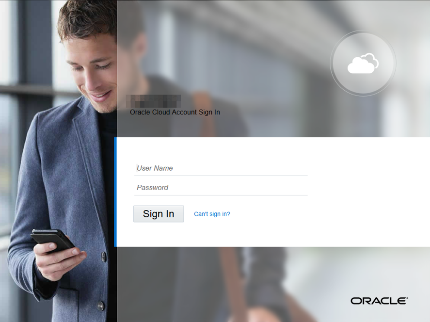
    Or, if you are already in the application, go to the \"Home\" page by selecting the \"Home\" hyperlink from the left panel.

3.  In the Home Page click on \"Monitor\" located at the left side.
    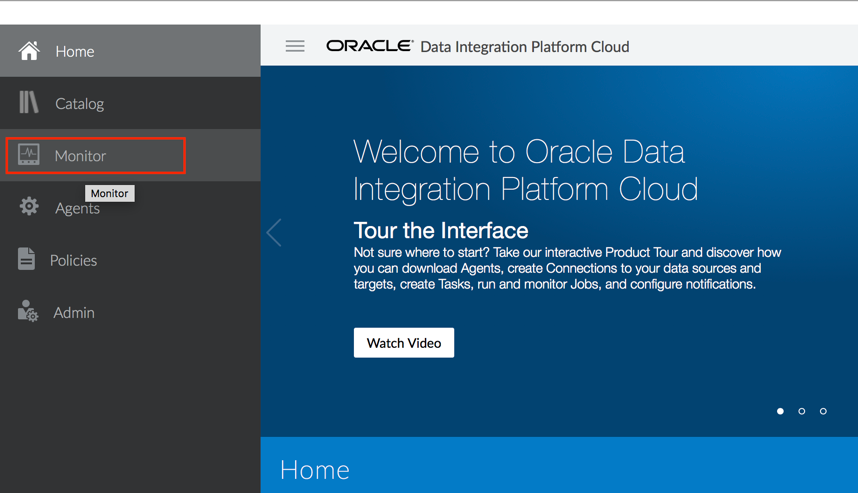

4.  This page will hold Summary for all the jobs, and then pages for
    these three specific types of jobs created from these tasks:
    Synchronize Data, Replicate Data and Data Lake Management. Each of
    these pages has three tiles and a table:
    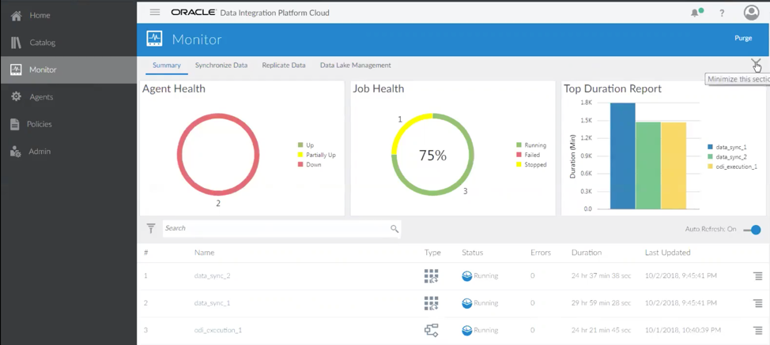

    - **Agent Health:** The Agent Health tile reports whether capture and delivery
    plugins related to Oracle Data Integration Platform Cloud tasks are running
    on the data sources or not which is different from the status of the agents
    displayed on the Agents page.

    - **Job Health:** The Job Health tile located in the Monitor page of Oracle
    Data Integration Platform Cloud displays information for all the Jobs
    ever run on the server.

    - **Top Duration Report:** The Top Duration tile in the Summary page of Monitor
    displays the top three jobs with the longest duration. Duration of a job is
    the job's end time minus its start time.

    - **Top Data Report:** The Top Data Report tile displays the top three Jobs
    with highest throughput in the past three days. Throughput is the number
    of operations replicated in the past three days in Megabytes/second.

    - **Top Lag Report:** The Top Lag Report tile displays the top three running
    Jobs with the most lag. The replication lag is calculated as difference in
    seconds between the time that a record was processed in the target and the
    timestamp of that process received through Data Integration Platform
    Cloud’s running agents on the source.

###   Here is how you can see all the jobs created in previous labs.

1.  Review Job from Lab 300:
    -	The job will automatically appear within the **Monitor** page.
    You should be able to find the job you created in Lab 300
    (Sync on-prem schemas).
    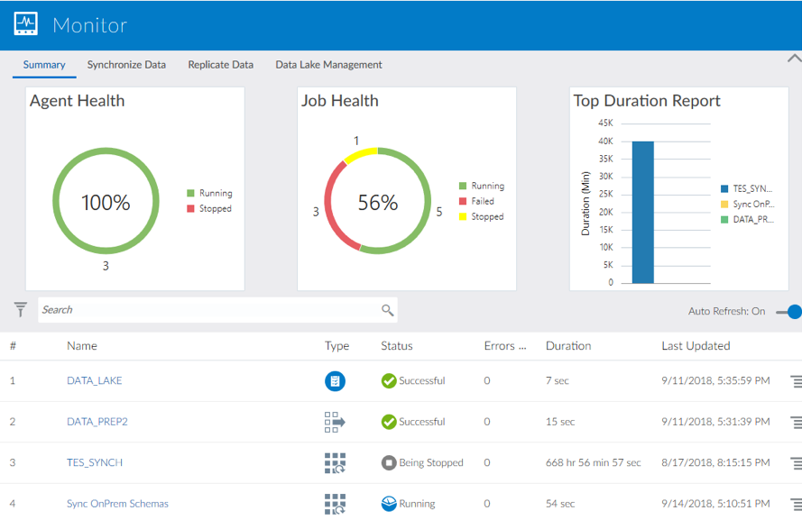

    -	Click on the job to review more details.
    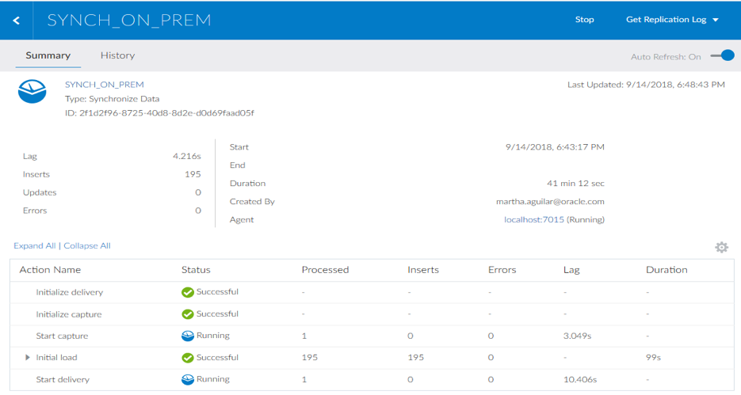

2.  Review Job from Lab 600:
    -	The job will automatically appear within the **Monitor** page.
    This may take up to 1 minute.
    

    -	You should be in the **Monitor** screen. Click on the job to see details.
     The **ODI Execution** action will show **Successful** after a little while.
    

    -	Once done, the **ODI Execution** action can be expanded to
    review the various steps underneath.
    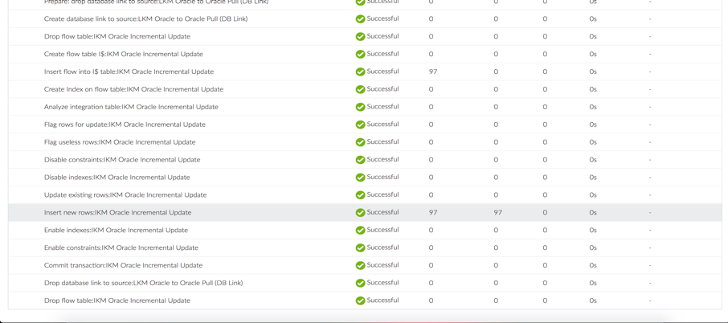

    -	Click on **Insert new rows: IKM Oracle Incremental Update** to review the
    code generated by DIPC for the task. This shows the SQL statements that are
    generated by the Knowledge Module, which is part of the ODI scenario.

    -	Click **Done** when you’ve completed the code review.
    

3.  Review Job from Lab 800:
    -	The job **DATA_LAKE** will automatically appear within the **Monitor**
    page. This may take up to 1 minute.
    If you want to stop/ restart the job then click on the hamburger menu
    on right on the job you created.
    

    -	On the **Monitor** page, click on the job you created which
    is **DATA_LAKE**, to see more details about the job.
    This will include the start and end time; duration of the job and
    how many rows were processed while executing this job.
    

4.  Review Job from Lab 1000:
    -	The job will automatically appear within the **Monitor** page.
    This may take up to 1 minute.
    If you want to restart the job then click on the hamburger menu
    on right on the job you created.
    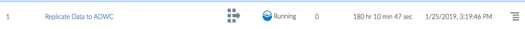

    -	On the “Monitor” screen. Click on the job to see details.
    The **Replicate Data to ADWC** action will show **Successful** after a
    little while. Click on the job name to check more details about the job.
    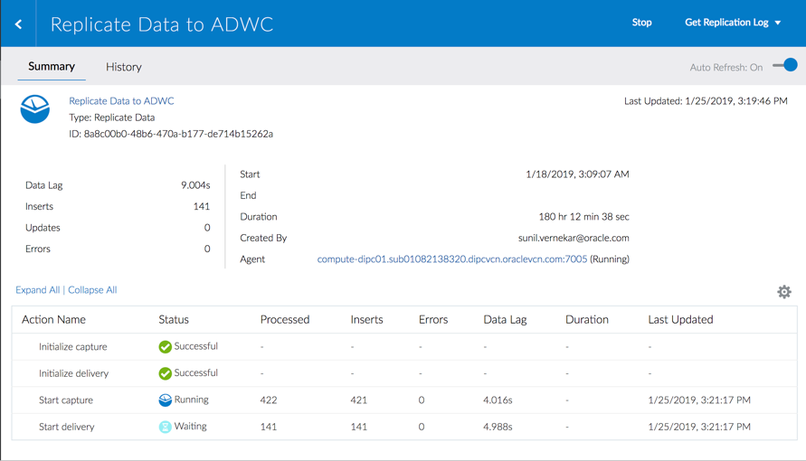

5.  Review Job from Lab 1300:
    -	The job will automatically appear within the **Monitor** page.
    This may take up to 1 minute. If you want to restart purge the job then
    click on the hamburger menu on right on the job you created.
    

    -	Click on **Monitor** from the menu and click on the job to see details.
    The **O2K** action will show **Successful** after a little while.
    Once the data inserted is committed, you should see one Insert shown
    in your Job as below.
    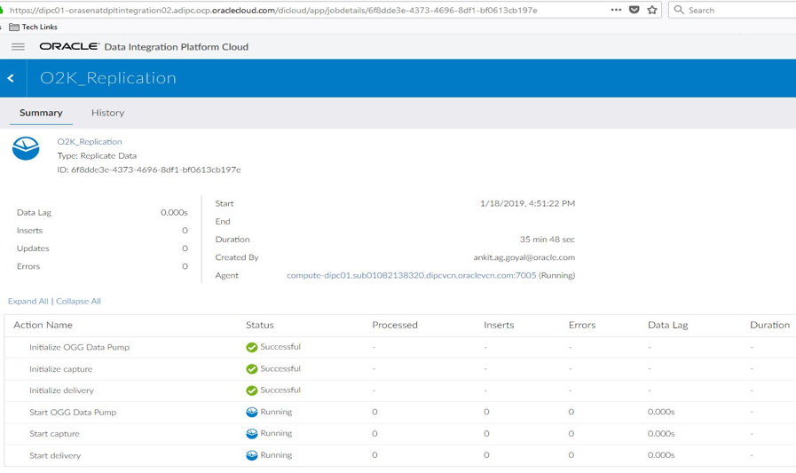

## Create Policies

**Policies** enable you to specify conditions for when and how often a job
should run and when you should be notified.

You're alerted to new notifications within the **Data Integration Platform
Cloud console**. The alert icon at the top of the page displays the number
of new notifications you have.

### Create a New Notification Policy

A **Notification** is an alert that you receive in Data Integration Platform
Cloud when Notification Policy conditions are met.

To view your notifications,
click the **Notifications** icon, displayed as a bell, accessible from
any page in your Data Integration Platform Cloud console.

1.  On the Policies page, click **Create**, and then
    select **Notification Policy**.
    

2.  On the Create Notification Policy page, complete the General
    Information fields as needed.
    

3.  For Severity, select the importance of your notification:
    **Low**, **Medium**, or **High**.

4.  Click **Enable this policy** to activate it.

5.  Under Policy Metrics, select when you should be notified, either
    when **All conditions are satisfied** or when **Any one condition is
    satisfied**, and then set the conditions:

    a.  Select a metric.

    b.  Select an operator.

    c.  Select or specify a value.

6.  Click **Save**.

7.  After you save your policy, it\'s listed on the Policies page where
    you then edit or delete it from its **Show Context menu**.
    

### Create a new Scheduling Policy

A **Scheduling Policy** sets the conditions for when and how often a job
should run in Data Integration Platform Cloud.

**To create a Scheduling Policy:**

1.  On the Policies page, click **Create**, and then select **Scheduling
    Policy**.
    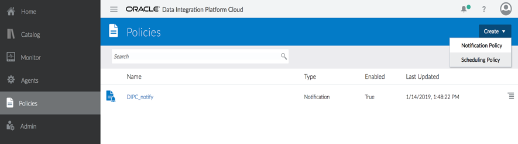

2.  On the Create Scheduling Policy page, complete the General
    Information fields as needed.
    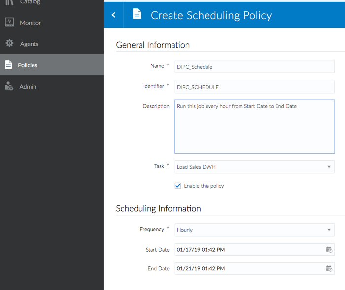

3.  Select the **Task** from the dropdown menu.

4.  Click **Enable this policy** to activate it.

5.  Under Scheduling Information:

    a.  Select how often you want the job to run from
        the **Frequency** menu.

    b.  Set the **Start Date** and **End Date** values.

6.  Click **Save**.

After you save your policy, it\'s listed on the Policies page where you
can edit or delete it from **Show Context menu**.
