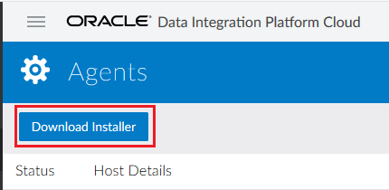
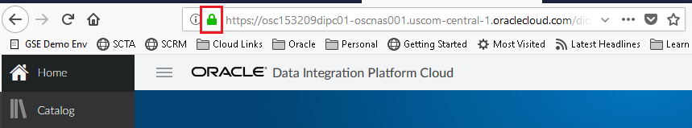
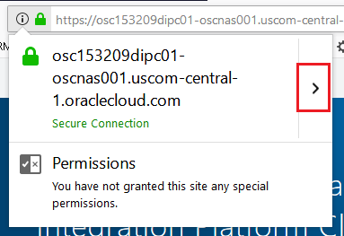
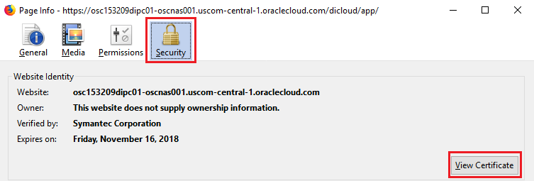
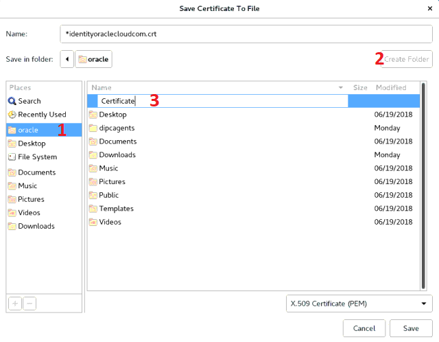
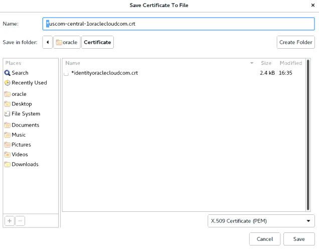

# Lab 300 - Remote Agent Install and On-prem to On-prem DB Synchronization


## Before You Begin

### Introduction

This lab covers installation and configuration of DIPC remote agent along with synchronization of two on-prem database schemas. Agents allow synchronization of data from sources outside Oracle Cloud. The target and source schemas will reside in the same database.

This lab supports the following use cases:
-   Configure Remote DIPC Agent
-   Synchronize two On-Premise Databases

### Objectives
-	Review downloading process, installation and configuration of DIPC remote agent
-   Synchronize two On-Premise Databases
   
### Time to complete
Approximately 45 minutes.

### What Do You Need?
Your will need:
- DIPC Instance URL
- DIPC User and Password
- DB information for on-prem source system: server name/ip address, user/password and service name
- DB information for on-prem target system: server name/ip address, user/password and service name
- Private keys in OpenSSH format for all instances 
- OnPremiseVM public IP address
- Putty for SSH connection to instances
- VNC viewer
- SQL developer


## Remote Agent

### Download Agent
1.	Open an SSH session into your compute server (we will simulate on-prem with a compute instance); please refer to Appendix 1 to learn how to establish a SSH session
2.	Open a VNC viewer; please refer to Appendix 2 to learn how to establish a VNC session
3.	Open a terminal; select “Applications } Favorites } Firefox” from the top left corner of the screen 

4.	Navigate to your DIPC server, provide the URL (it should look like this): https://osc132657dipc-oscnas001.uscom-central-1.oraclecloud.com/dicloud
5.	Provide your user name and password, then click "Sign In" button 

6.	This will bring you to your DIPC server’s  home page
7.	Click on “Agents” (left part of your screen) 

8.	Click on "Download Installer" button 

9. Open the drop down menu and select the Operating System of your choice; in our case “Linux” 

10.	Once you have selected the operating system, you can choose the components that you would need in your remote agent. Select "Oracle 12c" then click on "Download" button. 

11.	Select “Save File” and the click “OK”, to download the file to your “on-premise” machine 


### Download DIPC Certificate
1. If you are NOT already logged into your DIPC server, log into it. 
2. Once in your DIPC server, click on the green padlock icon on the left of the address field of your browser 

3.	Click on the arrow on the right side of the listed secure connection 

4.	Click on “More Information” hyperlink of the Site Security pop-up 

5.	In the “Website Identity” section of the “Security” tab click “View Certificate” button 

6.	In the “certificate Viewer” applet in the “Details” tab, click “Export …” button 

7.	On the left panel click on "oracle", then click button "Create Folder", provide name "Certificate" 

8. Now you are in the directory you just created, be sure to get rid of the character ("*" or “-“) located at the beginning of the default name. Click “Save’ button 

9.	Close all applets


### Add Certificate to Keystore
1.	In your on-prem machine, open a terminal, select “Applications } Favorites } Terminal” from the top left corner of the screen 

2.	Import the client side certificate into the cacerts in your system. Execute:
$JAVA_HOME/bin/keytool -import -alias uscom-central-1oraclecloudcom  -keystore $JAVA_HOME/jre/lib/security/cacerts -file /home/oracle/Certificate/uscom-central-1oraclecloudcom.crt
3.	Provide password: “changeit”
4.	Answer “yes” to question “trust this certificate?”


### Install Agent
1.	In the terminal you opened in your on-prem machine, create a directory for the agent's files, execute: mkdir dipcagent
3.	Move the downloaded file to that new directory, execute: mv Downloads/* dipcagent
4.	Move to the new directory, execute: cd dipcagent
5.	Unzip the file, execute: unzip agent-linux.64.bit.zip
6.	Move to the agent directory, execute: cd dicloud
7.	Execute command to install agent: 
./dicloudConfigureAgent.sh -recreate -debug -dipchost=**{DIPC SERVER HostName eg osc######DIPC##-oscnas001.uscom-central-1.oraclecloud.com}** -dipcport=443 -user=**{YOUR_CLOUD_ACCOUNT_USERNAME}** -password=**{YOUR_CLOUD_ACCOUNT_PASSWORD}** -authType=OAUTH2 -idcsServerUrl=https://idcs-bfb16122271a47fc91ada73842325e52.identity.oraclecloud.com -agentIdcsScope=https://919181A11AC6494CBCFA146EBC9A2A48.uscom-central-1.oraclecloud.com:443external -agentClientId=ec9958f548e7414f872cc480c0bf3455 -agentClientSecret=77321de1-6f4a-4997-945e-8acb271b0473
	```
	where:
		{DIPC SERVER} - This have been provided in your environment page. Look for entry DIPC SERVER.
		{YOUR_USER} - This is the login you use to log into Oracle Cloud/DIPC server
		{YOUR_PASSWORD} - This is the password of the login you use to log into Oracle Cloud/DIPC server
	```
8.	New directories will be created, to look at then execute: ls
9.	We will take a look at the configuration file (agent.properties) and we will change the port in which this agent will talk to DIPC
10.	Open the editor, select “Applications > Accessories > Editor” from the top left corner of the screen 

11.	Click on “Open” then “Other Documents” 

12.	Browse to “/home/oracle/dipcagent/dicloud/agent/dipcagent001/conf/agent.properties” 

13.	Modify agent port "agentPort" in parameter file "agent.properties" to 7010 

14.	Save and close. Click on “Save” button then on "Close" icon (top right corner)


### Start the Agent
1.	We will move to the directory with the necessary commands to start the agent; execute: cd agent/dipcagent001/bin
2.	We will start the agent by executing:
nohup ./startAgentInstance.sh &
3.	Your agent is now running. Go back to Firefox and look the “Agent” screen in DIPC 


## On-Prem to On-Prem synchronization

### Execute Data Synch Elevated Task
1. You should be logged into DIPC, if that is NOT the case, log in.
2. From the left side panel, SELECT "Home" 

3. For synchronization jobs we will need a CDB (Container DB) connection to our DB. In the Home Page click the “Create" button in the "Connection” box from top section 

4. Enter the following information:
    - Name: ONPREM_SRC_CDB
    - Description:  CDB User for on-prem source DB
	- Agent: **{REMOTE_AGENT}**
	- Type: Oracle
  	- Hostname: **{SERVER_IP_ADDRESS}**
	- Port: 1521
	- Username: C##GGSRC
	- Password: Welcome#123
	- Service Name: onprem
	```
	where:
		{REMOTE_AGENT} - Select theremote DIPC agent you just created
		{SERVER_IP_ADDRESS} - IP Address of the compute instance (simulated OnPrem environment)
	```
5. Click "Test Connection" button and when the test is successful click "Save" button.
6. Open the drop-down menu from the top far right corner and then select “Connection”.

7. Enter the following information:
    - Name: ONPREM_SRC
    - Description: Connection to on-prem database schema with source tables. AMER
	- Agent: {REMOTE_AGENT}
	- Type: Oracle
  	- Hostname: {SERVER_IP_ADDRESS}
	- Port: 1521
	- Username: AMER_SRC
	- Password: Welcome#123
	- Service Name: PDB1
    - Schema Name: AMER_SRC (Default)
	```
	where:
		{REMOTE_AGENT} - Select the remote DIPC agent you just created
		{SERVER_IP_ADDRESS} - IP Address of the compute instance (simulated OnPrem environment)
	```
8. Click on "Test Connection" button at the bottom. a green message should appear on top when everything is in order
9. Click on "Save" 

10. From the top bar, open the drop-down menu and the select "Connection" 

11. Enter the following information:
    - Name: ONPREM_TRG
    - Description: Connection to target schema onprem_trg EMEA
	- Agent: {REMOTE_AGENT}
	- Type: Oracle
	- Hostname: {SERVER_INSTANCE_IP}
	- Port: 1521
	- Username: EMEA_TRG
	- Password: Welcome#123
	- Service Name: PDB1
    - Schema Name: EMEA_TRG (Default)	
	```
	where:
		{REMOTE_AGENT} - Select theremote DIPC agent you just created
		{SERVER_IP_ADDRESS} - IP Address of the compute instance (simulated OnPrem environment)
	```	
12. Click on "Test Connection" button at the bottom. a green message should appear on top when everything is in order
13. Click on "Save" 

14. From the top bar, open the drop-down menu and the select "Synchronize Data" 

15. Enter the following information:
	- Name: Sync OnPrem Schemas
	- Description: Sync on-prem schemas AMER to EMEA
	- Connection: ONPREM_SRC
	- Schema: AMER
	- Connection: ONPREM_TRG
	- Schema: EMEA
	- Advanced - Include Initial Load: SELECTED
	- Advanced - Include Replication: SELECTED

16. Click on "Save & Run" button on the top right of the screen to execute the task
17. A message will appear in the notification bar and you will be navigated to the "Monitor" screen. 
18. The job will automatically appear within the "Monitor" page

19. Click job to review details 


### Verify Data in Source and Target DBs (Optional)
Up until this point, we have monitored the job within DIPC but it would nice to see the data in both source and target to verify that they are the same. For such task, we will use SQL Developer; please refer to Appendix 3 to learn how to create connections against the workshop databases.

1. Start SQL Developer. On the connections panel, select your source database WS - AMER_SRC) and click on the plus (+) sign to open the connection 

 
2.	Once opened, copy and paste the following statements in the panel on the right:
	```
		SELECT COUNT(*)CATEGORIES FROM CATEGORIES;
		SELECT COUNT(*)CUSTOMERS FROM CUSTOMERS;
		SELECT COUNT(*)CUSTOMERS_INFO FROM CUSTOMERS_INFO;
		SELECT COUNT(*)ORDERS FROM ORDERS;
		SELECT COUNT(*)ORDERS_TOTAL FROM ORDERS_TOTAL;
		SELECT COUNT(*)PRODUCTS FROM PRODUCTS;
		SELECT COUNT(*)PRODUCTS_DESCRIPTION FROM PRODUCTS_DESCRIPTION;
	```
3.	Execute the statements by clicking on the “Run script” icon (second icon from left to right on the icon bar; right-ponting green arrow head on top of a page) 

4.	This will show all entities count on the results panel (lower section) 

5.	Repeat steps 1 through 4 for connection “WS - EMEA_TRG” 


This will show that the count in both data bases is exactly the same.


## Summary
You have now successfully completed the Hands-on Lab, and have successfully installed the remote agent and synchronized two on-prem databases.
