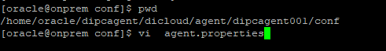
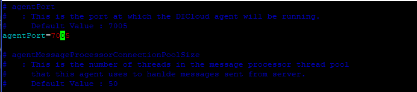
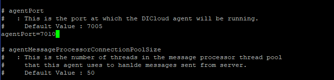
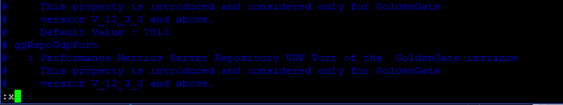
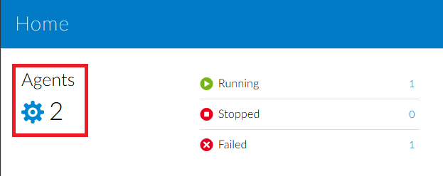
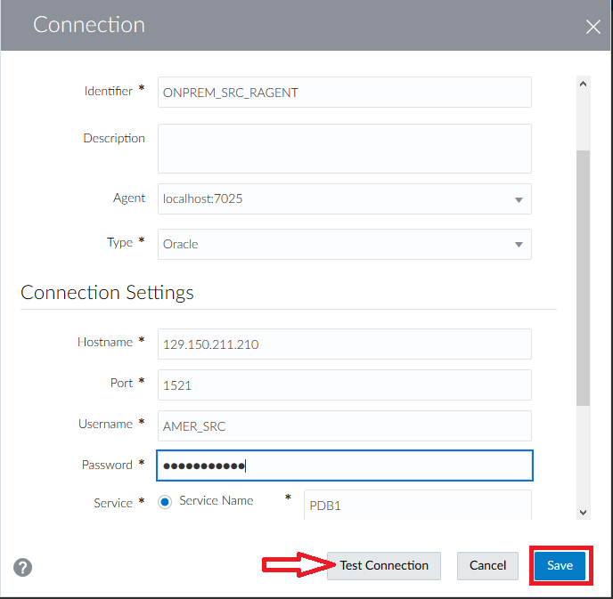
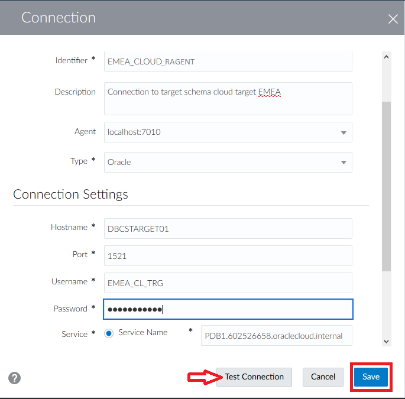
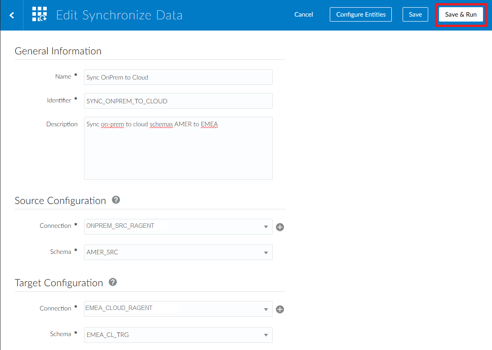
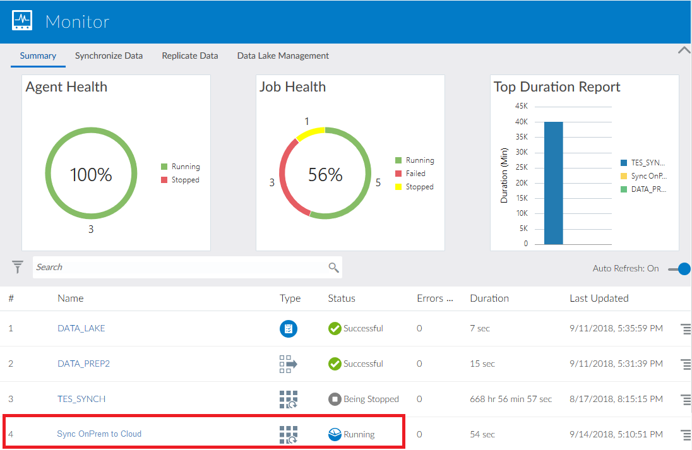
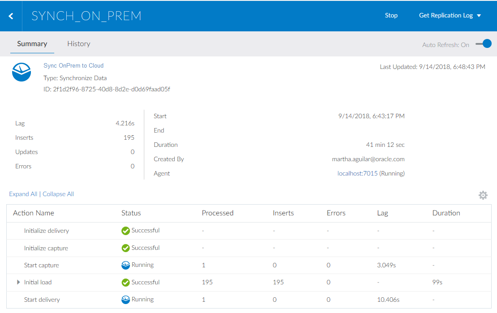

# Lab 400 - Migrate On-Prem Database to Cloud


## Before You Begin

### Introduction 
This lab covers synchronization of an on-prem and cloud database using a previously installed remote DIPC agent. Agents allow synchronization of data from sources outside Oracle Cloud. Two VMs will be used to simulate a DIPC instance and an On-Prem database server. The DIPC repository database also host the cloud target schema.


This lab supports the following use cases:
-   Configure Remote DIPC  (Optional already done in Lab 300)
-   Synchronize On-Premise Database

### Objectives
-   Review downloading process, installation and configuration of DIPC remote agent
-   Migrate an on-prem database to a database cloud service

### Time to complete
Approximately 45 minutes.

### What Do You Need?
Your will need:
- DIPC Instance URL
- DIPC User and Password
- DB information for on-prem source system: server name, user/password and service name
- DB information for cloud target system: server name, user/password and service name
- Private keys in OpenSSH format for all instances 
- OnPremiseVM public IP address
- Putty for SSH connection to instances
- VNC viewer
- SQL developer

## Remote Agent

### Install Agent
1.	Open an SSH session into your compute server (we will simulate on-prem with a compute instance); please refer to Appendix 1 to learn how to establish a SSH session
3.	Move to the directory where the remote agent was downloaded, execute: cd dipcagent/dicloud
7.	Execute command to install agent: 
./dicloudConfigureAgent.sh -recreate -debug -dipchost=**\<DIPC SERVER\>** -dipcport=443 -user=**\<YOUR_CLOUD_ACCOUNT_USERNAME\>** -password=**\<YOUR_CLOUD_ACCOUNT_PASSWORD\>** -authType=OAUTH2 -idcsServerUrl=https://idcs-bfb16122271a47fc91ada73842325e52.identity.oraclecloud.com -agentIdcsScope=**\<YOUR_DIPC_SECAPP\>** -agentClientId=4b8201b85cb946eab6f0006c37093f26 -agentClientSecret=c5e45679-aa81-4d98-a574-01c0484b37b6
	```
	where:
		<DIPC SERVER> - This is the name of your DIPC Server. This have been provided in your environment page; look for entry DIPC SERVER. For example, osc######DIPC##-oscnas001.uscom-central-1.oraclecloud.com
		<YOUR_USER> - This is the login you use to log into Oracle Cloud/DIPC server. This have been provided in your environment page; look for entry YOUR_USER
		<YOUR_PASSWORD> - This is the password of the login you use to log into Oracle Cloud/DIPC server. This have been provided in your environment page; look for entry YOUR_PASSWORD
		<YOUR_DIPC_SECAPP> - This is the scope of the security application defined in the Identity Server. This have been provided in your environment page; look for entry YOUR_DIPC_SECAPP
	```
8.	New directories will be created, to look at them execute: ls
9.	We will take a look at the configuration file (agent.properties) and we will change the port in which this agent will talk to DIPC. Move to the configuration directory, execute: cd /home/oracle/dipcagent/dicloud/agent/dipcagent001/conf
10.	Open the file: nano agent.properties 

11.	Locate parameter "agentPort"

12.	Change the port from "7005" to "7010"

13.	Save your changes, press ctrl-x, "Y", then press the ENTER key



### Start the Agent
1.	We will move to the directory with the necessary commands to start the agent; execute: cd /home/oracle/dipcagent/dicloud/agent/dipcagent001/bin
2.	We will start the agent by executing:
nohup ./startAgentInstance.sh &
3.	Your agent is now running. If your not logged, log into your DIPC server and navigate to the "Agents" screen

4. You will see the new remote agent


## Migrate On-Prem to the Cloud

### Execute Data Synch Elevated Task
1. You should be logged into DIPC, if that is NOT the case, log in.
2. From the left side panel, SELECT "Home" 

3. If you have already created connection "ONPREM_SRC", skip to step 7. If connection "ONPREM_SRC" has NOT yet been created, in the Home Page click "Create Connections" from the top section 

4. Enter the following information:
    - Name: ONPREM_SRC_RAGENT
    - Description: Connection to on-prem database schema with source tables. AMER
	- Agent: **\<REMOTE_AGENT\>**
	- Type: Oracle
  	- Hostname: **\<SERVER_IP_ADDRESS\>**
	- Port: 1521
	- Username: AMER_SRC
	- Password: Welcome#123
	- Service Name: PDB1
    ```
    where:
        <REMOTE_AGENT> - Select the remote DIPC agent 
        <SERVER_IP_ADDRESS> - IP Address of the compute instance we are using to simulate on-premise environment. This have been provided in your environment page; look for entry SERVER _IP_ADDRESS        
    ```
5. Click "Test Connection" button and when the test is successful click "Save" button.

6. In the catalog screen, open the drop-down menu from the top far right corner and then select “Connection”

7. Enter the following information:
    - Name: EMEA_CLOUD_RAGENT
    - Description: Connection to target schema cloud target EMEA
	- Agent: **\<REMOTE_AGENT\>**
	- Type: Oracle
	- Hostname: **\<TARGET_DB_NAME\>**
	- Port: 1521
	- Username: EMEA_CL_TRG
	- Password: Welcome#123
	- Service Name: **\<TARGET_DB_SERVICE_NAME\>**
    - Schema Name: EMEA_CL_TRG (Default)
```
where:
    <REMOTE_AGENT> - Select the remote DIPC agent 
    <TARGET_DB_NAME> - Name of the target database server. This have been provided in your environment page; look for entry TARGET_DB_NAME
    <TARGET_DB_SERVICE_NAME> - Service name string for the target database server. This have been provided in your environment page; look for entry TARGET_DB_SERVICE_NAME
```
8. Click "Test Connection" button and when the test is successful click "Save" button

9. From the top bar, on the right corner, open the drop-down menu and the select "Synchronize Data"

10. Enter the following information:
	- Name: Sync OnPrem to Cloud
	- Description: Sync on-prem to cloud schemas AMER to EMEA
	- Connection: ONPREM_SRC_RAGENT
	- Schema: AMER_SRC
	- Connection: EMEA_CLOUD_RAGENT
	- Schema: EMEA_CL_TRG
	- Advanced - Include Initial Load: SELECTED
	- Advanced - Include Replication: SELECTED
9. Click on "Save & Run" button on the top right of the screen to execute the task

10. You will be navigated to the "Monitor" screen. After some time, a message will appear in the notification bar
11. The job will automatically appear in the "Jobs" list
12. Click job to review details

13. Details on the jobwill be provided



### Verify Data in Source and Target DBs (Optional)
Up until this point, we have monitored the job within DIPC but it would nice to see the data in both source and target to verify that they are the same. For such task, we will use SQL Developer; please refer to Appendix 3 to learn how to create connections against the workshop databases.
1.	Start SQL Developer. On the connections panel, select your source database (WS - AMER_SRC) and click on the plus (+) sign to open the connection 

2.	Once opened, copy and paste the following statements in the panel on the right:
```
SELECT COUNT(*)CATEGORIES FROM CATEGORIES;
SELECT COUNT(*)CUSTOMERS FROM CUSTOMERS;
SELECT COUNT(*)CUSTOMERS_INFO FROM CUSTOMERS_INFO;
SELECT COUNT(*)ORDERS FROM ORDERS;
SELECT COUNT(*)ORDERS_TOTAL FROM ORDERS_TOTAL;
SELECT COUNT(*)PRODUCTS FROM PRODUCTS;
SELECT COUNT(*)PRODUCTS_DESCRIPTION FROM PRODUCTS_DESCRIPTION;
```
3.	Execute the statements by clicking on the “Run script” icon (second icon from left to right on the icon bar; right-ponting green arrow head on top of a page)

4.	This will show all entities count on the results panel (lower section) 

5.	Repeat steps 1 through 4 for connection “WS - EMEA_CL_TRG”     

This will show that the count in both data bases is exactly the same.


## Summary
You have now successfully completed the Hands-on Lab, and have successfully installed the remote agent and migrated a database from on-prem to cloud.