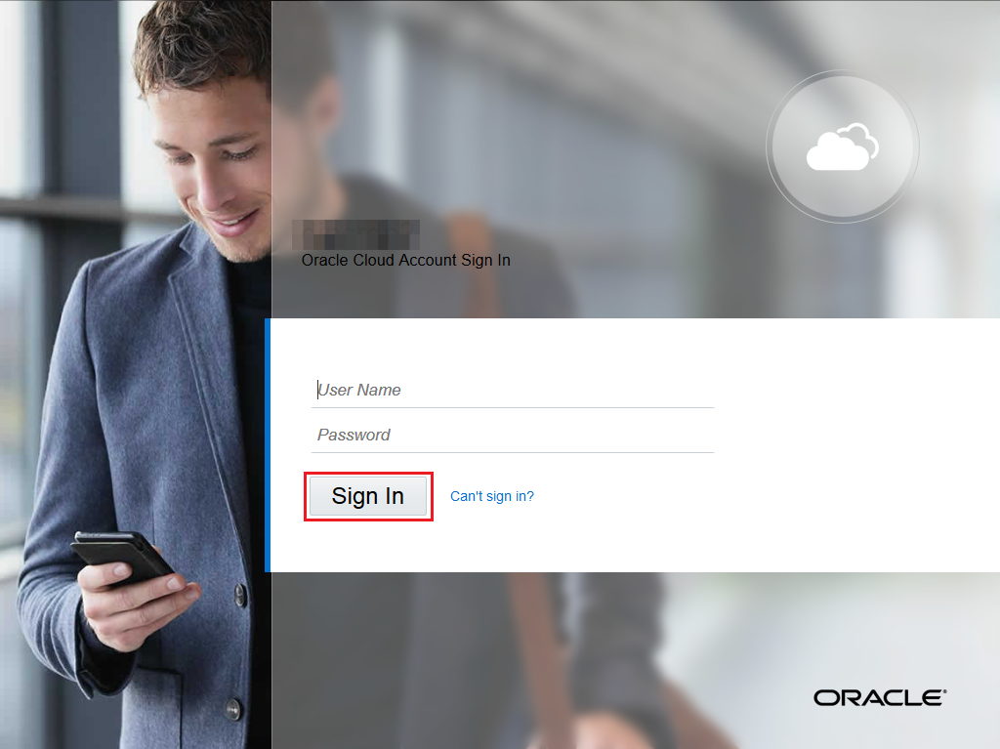
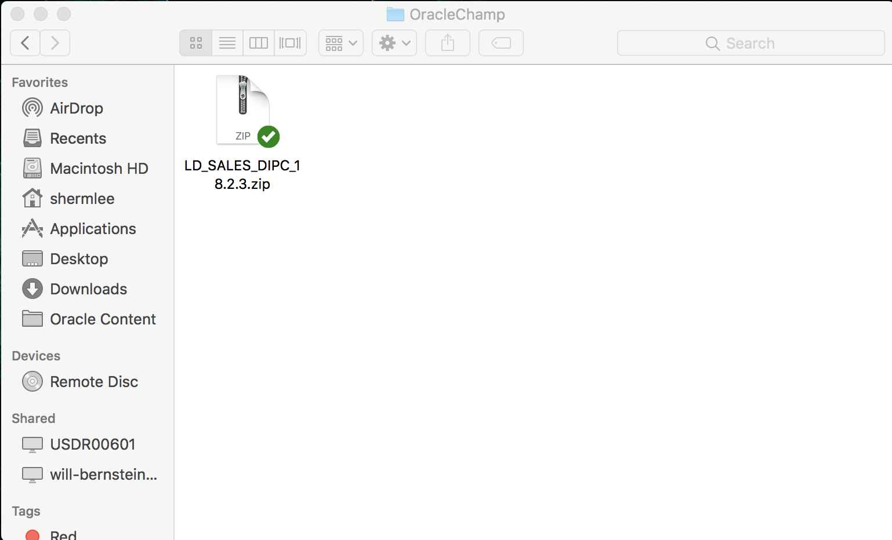
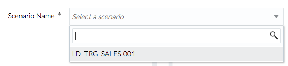
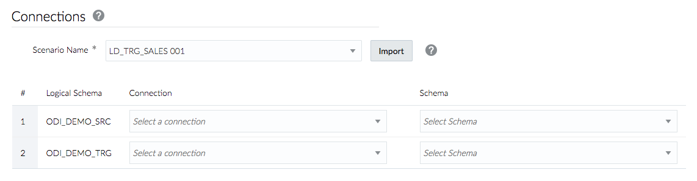
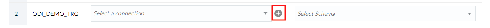
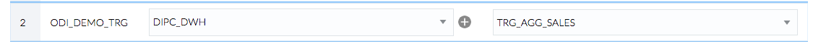
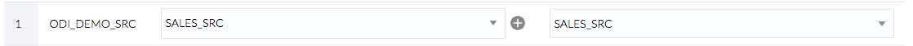
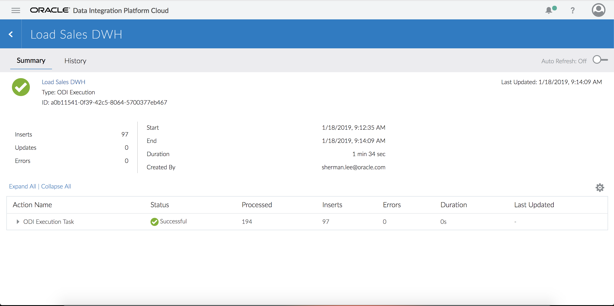
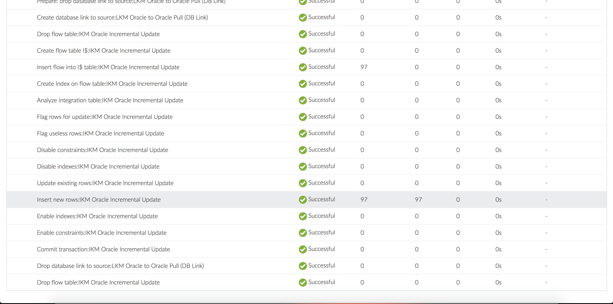

# Lab 600 - ODI Execution Elevated Task 


## Before You Begin

### Objectives
-   Undertsand how to import ODI scenarios
-   Execute and monitor ODI scenarios using DIPC

### Time to Complete 
Approximately 20 minutes.

### What Do You Need?
Your will need:
- DIPC Instance URL
- DIPC User and Password
- DB information for source system: server name, user/password and service name
- File "LD\_SALES\_DIPC\_18.2.3.zip"
- General understanding of RDBMS and data integration concepts
- General understanding of ETL and data synchronization concepts
- SQL Developer

### Scenario
This scenario joins SRC\_ORDERS and SRC\_ORDER\_LINES in the SALES DB (source), aggregates the data, filters for ORDERS with Status of "CLO" as well as performs an incremental update so only replicated rows, that have a status of "CLO" (closed) will be loaded to the target Data Warehouse (DWH).


## ODI Execution Elevated Task

### Verify Sales table in the DWH before execution (optional)
Before we execute the ODI task that will aggregate the data, you might want to verify that the Sales table in the DWH is empty.
1.	Go to SQL Developer. On the connections panel, select your DWH (WS - TRG\_AGG\_SALES) and click on the plus (+) sign to open the connection 

2.	Once opened, copy and paste the following statements in the panel on the right:
SELECT COUNT(*) FROM TRG_SALES; 

3.	Execute the statements by clicking on the “Run script” icon (first one from left to right on the icon bar)
4.	This will show the count on the results panel (lower section) 


### Create ODI Execution task
1.	Log into your DIPC server, provide the URL (it should look like this): 
https://dipc01-orasenatdpltintegration02.adipc.ocp.oraclecloud.com/dicloud/app/index.html
2.	Provide your user name and password, then click "Sign In" button 

Or, if you are already in the application, go to the "Home" page by selecting the "Home"hyperlink from the left panel. 
3.	In the Home Page click on "Next" icon (>) located at the far right side of the top panel to locate the "ODI Execution" task icon 
4.	Once you have located the “ODI Execution” task icon, click on the “Create" button.  
5.	Provide the following information:
	- Name:  Load Sales DWH
	- Description: Execute ODI Scenario to load OLTP data into DW 
	
6.	In the “Connections” section, click on “Import" button to import a deployment archive created in ODI Studio that contains the Scenario we want to execute.
7.	Navigate to the directory in which you copied the files provided for the labs and select “LD\_SALES\_DIPC\_18.2.3.zip”. Click on “Open” button. 

8.	Wait for the import operation to complete (this will take some time). Once completed, click on “Scenario” drop-down menu 

9.	Select “LD\_TRG\_SALES\_001”. This will show the connections the ODI scenario uses and that we need to map 

10.	We already have some connections defined but we will define a new connection to our target DWH. Click on the plus icon on the first row 

11.	Provide the following information:
	- Name: DIPC_DWH
	- Description: Data Warehouse
	- Agent: **\<REMOTE_AGENT\>**
	- Type Oracle
	- Hostname: **\<TARGET_DB_NAME\>**
	- Port: 1521
	- Username: TRG_AGG_SALES
	- Password: **\<_DB_PASSWORD\>**
	- Service Name: **\<TARGET_DB_SERVICE_NAME\>**
	- Schema Name: TRG_AGG_SALES (Default)
	```
	where:
		<REMOTE_AGENT> - Select the DIPC agent you created
		<TARGET_DB_NAME> - Name of the target database server. This have been provided in your environment page; look for entry TARGET_DB_NAME
    	<TARGET_DB_SERVICE_NAME> - Service name string for the target database server. This have been provided in your environment page; look for entry TARGET_DB_SERVICE_NAME
	```
12.	Click on “Test Connection” button at the bottom. A green message should appear on top when everything is in order 


13.	Click on “Save” button at the bottom. DIPC will create the connection and return to the original screen with that connection selected.
14.	Using the drop-down menu on the “Schema” attribute of the first row, select “TRG\_AGG\_SALES” 

15.	Using the drop-down menu on the “Connection” attribute of the second row, select “SALES\_SRC”
16.	Using the drop-down menu on the “Schema” attribute of the second row, select “SALES\_SRC” 

17.	Click on “Save and Run” button located on the top right corner of the screen to execute the task
18.	You will be navigated to the “Monitor” screen. After some time, a message will appear in the notification bar 

19.	The job will automatically appear within the "Monitor" page. This may take up to 1 minute 


### Review Job in DIPC
1.	You should be in the “Monitor” screen. Click on the job to see details. The "ODI Execution" action will show "Successful" after a little while 

2.	Once done, the “ODI Execution” action can be expanded to review the various steps underneath 

3.	Click on “Insert new rows:IKM Oracle Incremental Update” to review the code generated by DIPC for the task. This shows the SQL statements that are generated by the Knowledge Module, which is part of the ODI scenario
4.	Click "Done" when you’ve completed the code review 


### Verify Sales table in the DWH after execution (Optional)
1.	Go to SQL Developer. On the connections panel, select your DWH (WS - TRG\_AGG\_SALES) and click on the plus (+) sign to open the connection 

2.	Once opened, copy and paste the following statements in the panel on the right:
SELECT COUNT(*) FROM TRG\_SALES;

3.	Execute the statements by clicking on the “Run script” ( ) icon (second from left to right on the icon bar
4.	This will show the count on the results panel (lower section) and data in loaded into the target table


## Summary
In this lab, we have seen how it is possible to import ODI flows into DIPC and execute them; making possible for DIPC and standalone ODI to work hand in hand to implement an end-to-end data flow.