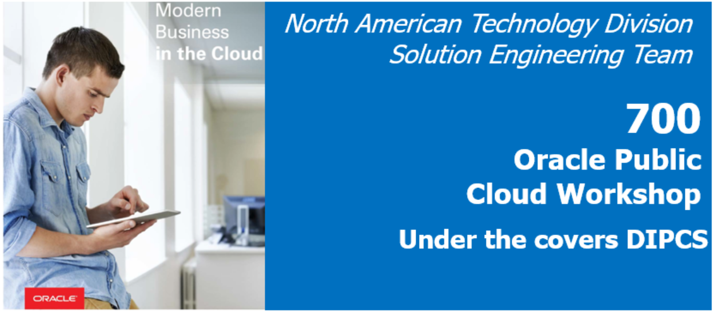
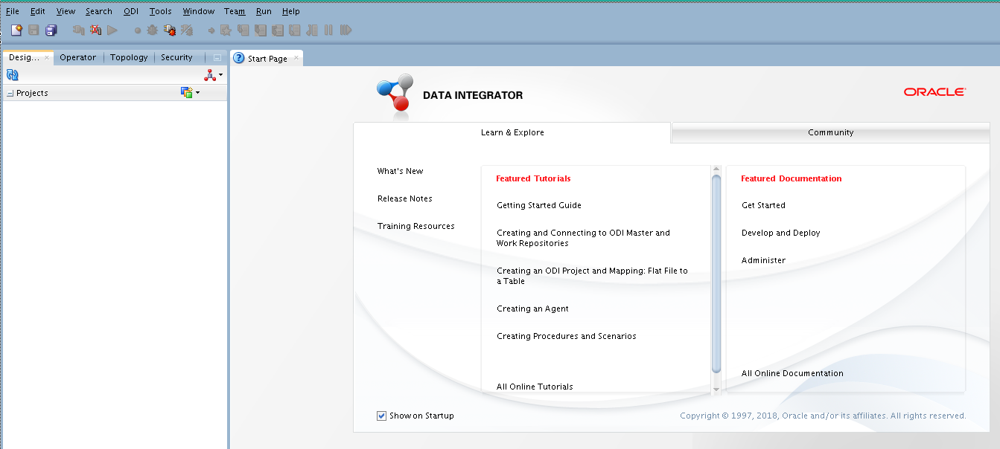

# Lab 700 - Under the covers DIPCS

## Before You Begin

### Objectives
- Demonstrate how to work directly with underneath DIPC GG "engine"
- Demonstrate how to work directly with underneath DIPC ODI "engine"
- Demonstrate how to work directly with underneath DIPC EDQ "engine"

### Time to Complete 
GG: Approximately ** minutes
ODI: Approximately ** minutes
EDQ: Approximately 90 minutes

### What Do You Need?
Your will need:
- DIPC Instance URL
- DIPC User and Password
- ODICS Server IP Address
- VNC viewer to establish a graphic session against ODICS server
- Wallet password for ODI Studio credentials
- General understanding of data quality

## GoldenGate (GG)

## Oracle Data Integration (ODI)

### Accessing ODI Studio
1.	Open an SSH session into the ODICS server; please refer to Appendix 1 to learn how to establish a SSH session against the ODICS server

2.	Open a VNC viewer; please refer to Appendix 2 to learn how to establish a VNC session against the ODICS server

3.	Open a terminal; select “Applications > System Tools > Terminal” from the top left corner of the screen 

4.	Execute: 
- cd /u01/app/oracle/middleware/odi/studio/bin
- ./odi  

5.	ODI Studio will come up. Click on “Connect to Repository…” 

6.  Enter wallet password for ODI Studio login credentials: welcome1

7.	Use login “ODI_REPO_USER”. Click on “OK” button 

8.	You are now in ODI Studio 

## EDQ