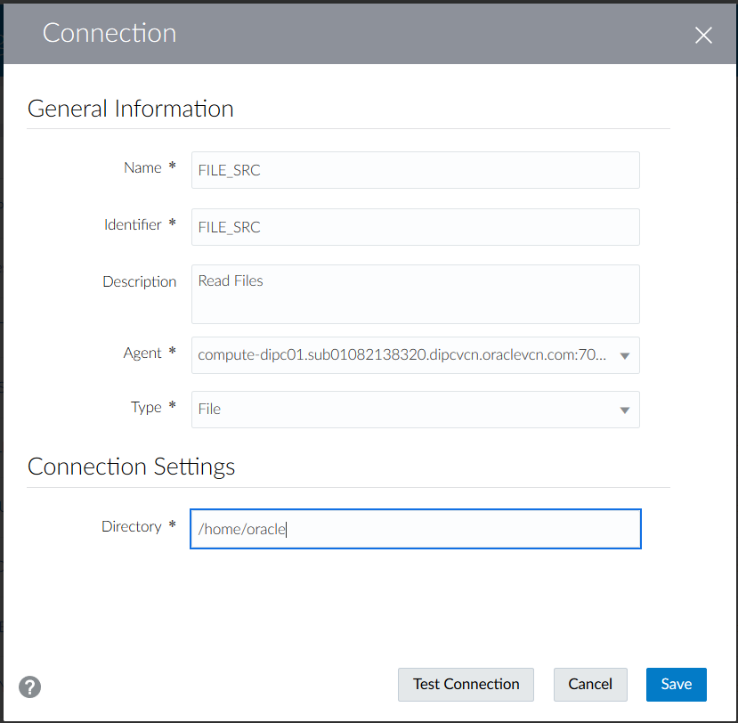

# Lab 800 - Data Lake Builder Elevated Task 


## Before You Begin

### Objectives
-   Review how to create connections to Oracle Object Storage
-   Review how to execute a Data Lake Builder task

### Time to Complete 
Approximately 15 minutes.

### What Do You Need?
Your will need:
- DIPC Instance URL
- DIPC User and Password
- Connection information for an Oracle Object Storage container: domain, URL, user/password and container name
- Flat file "webclicks.txt"


## Data Lake Builder Elevated Task

### Create Connection to File (Source)
1. Log into your Workshop DIPC Server
2.	In the Home Page click “Create" button on the "Connection” box from top section 

3. 	Enter the following information:
	- Name: FILE_SRC
	- Description: Read Files
	- Agent: **\<REMOTE_AGENT\>**
	- Type: File
	- Directory: /home/oracle
	```
	where:
		<REMOTE_AGENT> - Select the DIPC agent you created 
	```
	


 4. Click "Test Connection" button and when the test is successful click "Save" button 
 	


### Create Connection to Object Storage (Target)
1. From the "Create" drop down menu on the top right corner select "Connection" 

2.	Enter the following information:
    - Name: forAdw 
    - Description: Connection to Object Storage Classic
    - Agent: **\<REMOTE_AGENT\>**
    - Type: Oracle Object Storage Classic.
    - Domain: **\<OBJECT_STORAGE_DOMAIN\>**
	- Service URL: **\<OBJECT_STORAGE_URL\>**
	- Container: DIPC Workshop
    - Username: **<YOUR_USER\>**
    - Password: **<YOUR_PASSWORD\>**
	```
	where:
		<REMOTE_AGENT> - Select the DIPC agent you created 
		<OBJECT_STORAGE_DOMAIN> - This have been provided in your environment page; look for entry OBJECT_STORAGE_DOMAIN
		<OBJECT_STORAGE_URL> - This have been provided in your environment page; look for entry OBJECT_STORAGE_URL
		<YOUR_USERNAME> - This is the login you use to log into Oracle Cloud/DIPC server. This have been provided in your environment page; look for entry YOUR_USER.
		<YOUR_PASSWORD> - This is the password of the login you use to log into Oracle Cloud/DIPC server. This have been provided in your environment page; look for entry YOUR_PASSWORD.
	```
3. Click "Test Connection" button and when the test is successful click "Save" button. 


### Create Data Lake (Target)
1. From the "Create" drop down menu on the top right corner select "Data Lake" 

2.	Enter the following information:
    - Name: DATA_LAKE
    - Description: Creating a data lake
    - Connection: forAdw
    - Type: Parquet

3. Click "Save" button and when the test is successful click "Save" button. 


### Data Lake Builder task
1.	From the "Create" drop down menu on the top right corner select "Add Data to Data Lake" 

2.	Provide the following information:
	- Name:  DATA_LAKE
	- Description: Create Datalake pipeline
	- Connection: FILE_SRC
	
	- Directory: /home/oracle 
		- If you would like to select a different directory, click on the "Select" button on the right of the field 
		
		- Navigate to the directory then click on "Select" button 
	- File: webclicks.txt
		- Click on the "Select" button on the right of the field
		
		- Click on  "webclicks.txt" file and then click on "Select" button 
	- Connection: DATA_LAKE
	- Data Entity: Web_Clicks
	- Type: Parquet
	- File Path: **\<YOUR_USERNAME\>**
	```
	where:
		<YOUR_USER> - This is the login you use to log into Oracle Cloud/DIPC server. This have been provided in your environment page; look for entry YOUR_USER. Please use your user name to assure the file has a unique name and there is no problems with other workshop participants.
	```
		
	

3. Click on "Save & Execute" button located on the top right corner of the screen to execute the task 

4.	A meesage  will appear in the notification bar to inform that the test has been created and you will be navigated to the “Monitor” screen. 
5.	The job will appear in the "Monitor" page. This may take up to 1 minute


### Review Job in DIPC
1.	You should be in the “Monitor” screen. Click on the job to see details. The DATA_LAKE job will show "Successful" after a little while 

2.	Review the details provided (start and end time, duration, processed rows, etc). Once finished, click on the "Home" hyperlink located on the left panel 


## Summary
In this lab, we have seen how to create a data pipeline to object storage; this data can then be used by other application (Big Data, etc.)
