# Lab 800 - Data Lake Builder Elevated Task 

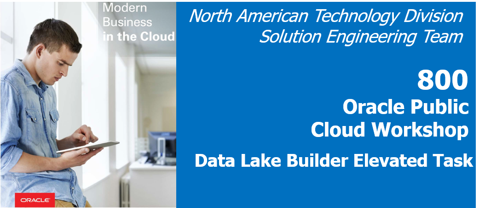

## Before You Begin

### Objectives
-   Review how to create connections to Oracle Object Storage
-   Review how to execute a Data Lake Builder task

### Time to Complete 
Approximately 15 minutes.

### What Do You Need?
Your will need:
- DIPC Instance URL
- DIPC User and Password
- Connection information for an Oracle Object Storage container: domain, URL, user/password and container name
- Flat file "webclicks.txt"

## Data Lake Builder Elevated Task

### Navigate to Oracle Object Storage container
Before we execute the task, we will navigate to the Object Storage container and gather the necessary information to connect within DIPC, as well as to verify that the container is empty. First of all we will log into you Oracle cloud instance:
1. In your web browser, navigate to cloud.oracle.com, then click Sign in.
2. Provide the cloud account: oscnas001 then <Enter>
3. Provide your user name and password, then click Sign In.

4. Locate Storage Classic service in your dashboard and click in the hamburger menu; then click on "Open Service Console" option

5. In the Storage Classic screen scroll down until you find container "DIPC Workshop", click on it

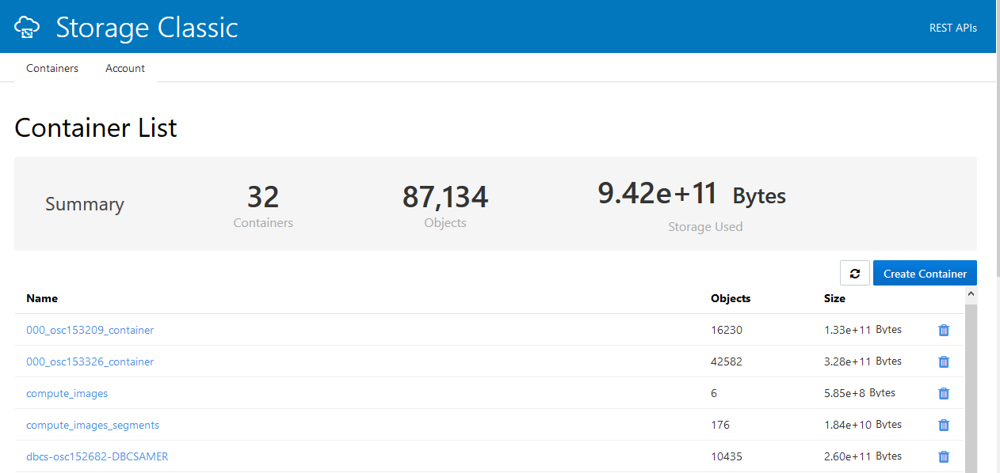

6. You will see that the container is empty and there is no files on it. We will now gather the necessary information to connect from DIPC, Click on the "Account" tab on top

7. Copy the content of field "Rest Endpoint". It should look like this: https://uscom-east-1.storage.oraclecloud.com/v1/Storage-oscnas100 

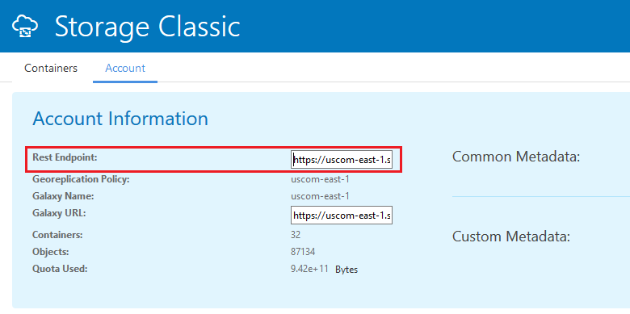

8. Store it in a notepad or other text editor, you will need this URL later/

### Create Connection to File (Source)
1. Log into your Workshop DIPC Server
2.	In the Home Page click “Create" button on the "Connection” box from top section

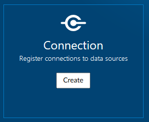

3. 	Enter the following information:
	- Name: FILE_SRC
	- Description: Read Files
	- Agent: **{LOCAL_AGENT}**
	- Type: File
	- Directory: /home/DIPC

where:

{LOCAL_AGENT} - Select the local DIPC agent 

 4. Click "Test Connection" button and when the test is successful click "Save" button

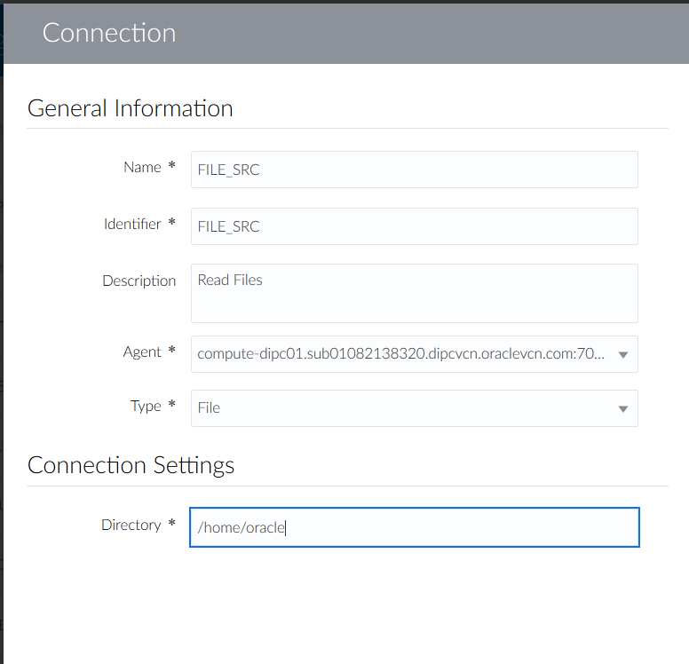

### Create Connection to Object Storage (Target)
1. From the "Create" drop down menu on the top right corner select "Connection"

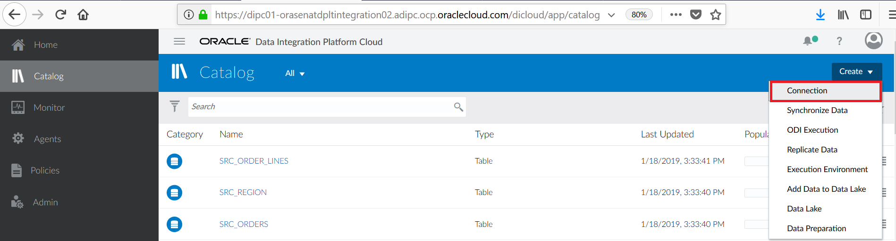

2.	Enter the following information:
    - Name: DATA_LAKE
    - Description: Connection to Object Storage to create a Data Lake
    - Agent: **{LOCAL_AGENT}**
    - Type: Oracle Object Storage Classic.
    - Domain: Storage-oscnas001. **From the Rest EndPoint URL you saved previously copy and paste the last part. That is from "https://uscom-east-1.storage.oraclecloud.com/v1/Storage-oscnas100" copy "Storage-oscnas001"**
	- Service URL: https://oscnas001.us.storage.oraclecloud.com. **From the Rest EndPoint URL you saved previously copy and paste the server URL. That is from "https://uscom-east-1.storage.oraclecloud.com/v1/Storage-oscnas100" copy "https://uscom-east-1.storage.oraclecloud.com"**
	- Container: DIPC_Workshop
    - Username: <YOUR_USERNAME>. **For example: osc.dipcws01**
    - Password: <YOUR_PASSWORD>

where:

{LOCAL_AGENT} - Select the local DIPC agent 

3. Click "Test Connection" button and when the test is successful click "Save" button. 

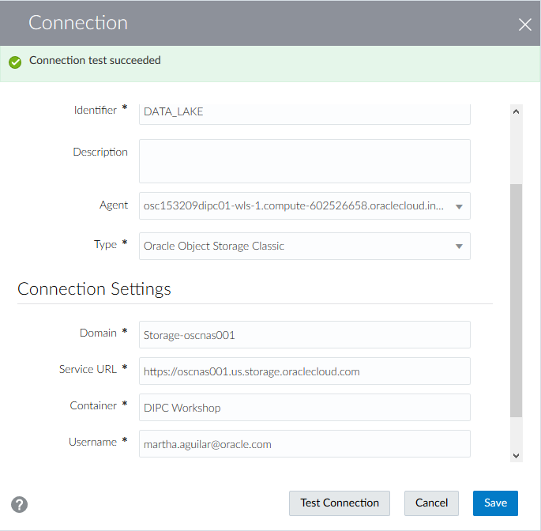

### Data Lake Builder task
1.	From the "Create" drop down menu on the top right corner select "Datalake Builder"

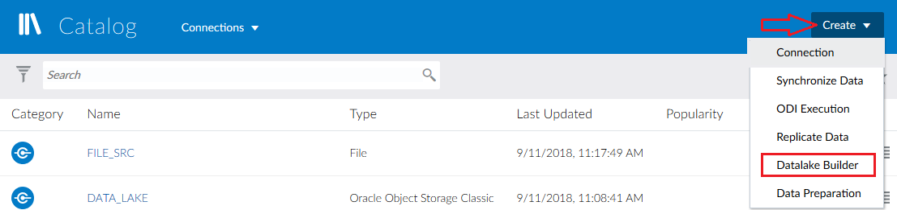

2.	Provide the following information:
	- Name:  DATA_LAKE
	- Description: Create Datalake pipeline
	- Connection: FILE_SRC
	- Directory: /home/DIPC/Files. 
		- Click on the "Select" button on the right of the field
		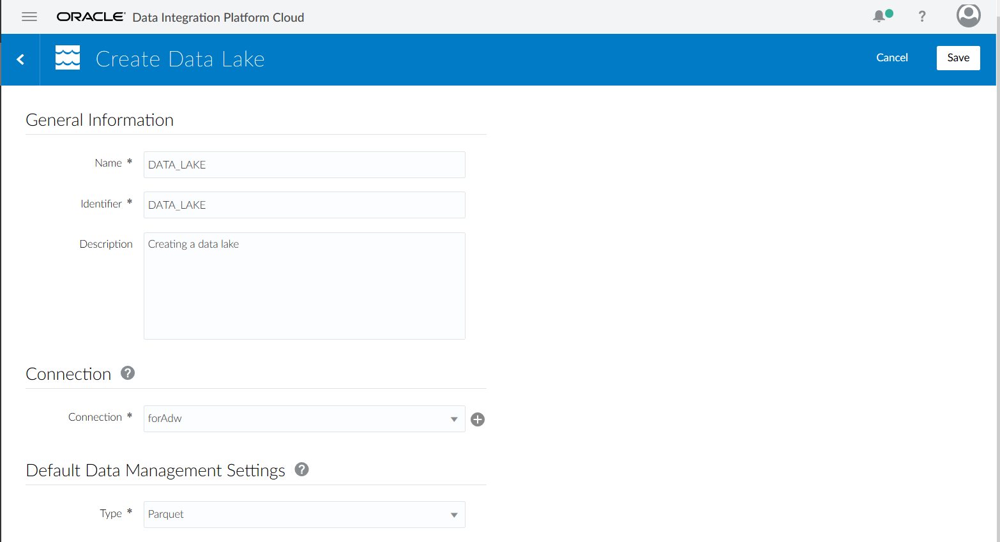

		- Cl;ick on "Files" directory and then click on "Select" button
		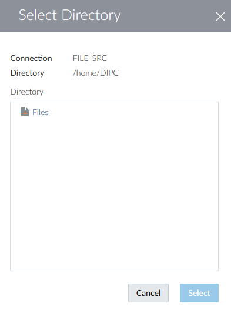
	- File: webclicks.txt
		- Click on the "Select" button on the right of the field
		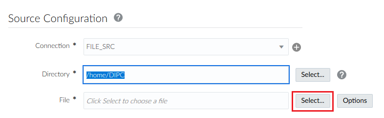

		- Click on  "webclicks.txt" file and then click on "Select" button
		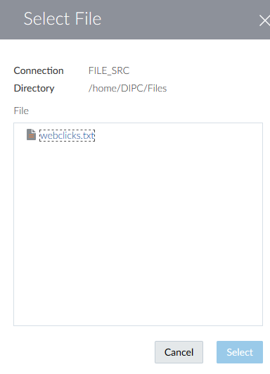
	- Connection: DATA_LAKE
	- Data Entity: Web_Clicks
	- Type: Parquet
	- File Path: <YOUR_USERNAME>. **For example: osc.dipcws01**
3. Click on "Save & Execute" button located on the top right corner of the screen to execute the task

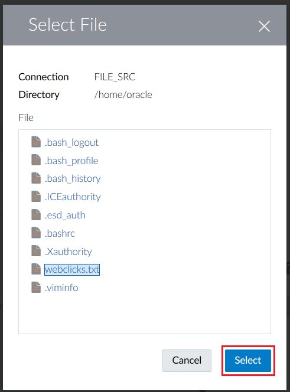

4.	A meesage  will appear in the notification bar to inform that the test has been created and you will be navigated to the “Monitor” screen. 

5.	The job will appear in the "Monitor" page. This may take up to 1 minute

### Review Job in DIPC
1.	You should be in the “Monitor” screen. Click on the job to see details. The DATA_LAKE job will show "Successful" after a little while

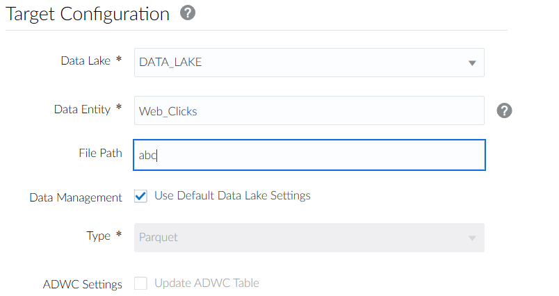

2.	Review the details provided (start and end time, duration, processed rows, etc). Once finished, click on the "Home" hyperlink located on the left panel

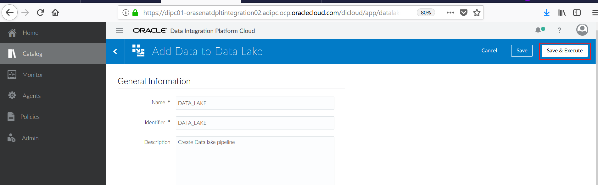

### Verify File in Object Storage (Optional)
1.	Navigate to object storage container "DIPC Workshop" in your system. Refer to section "Navigate to Oracle Object Storage container" steps 1 to 5 to refresh your memory on how to navigate to the Object Storage Classic screen.

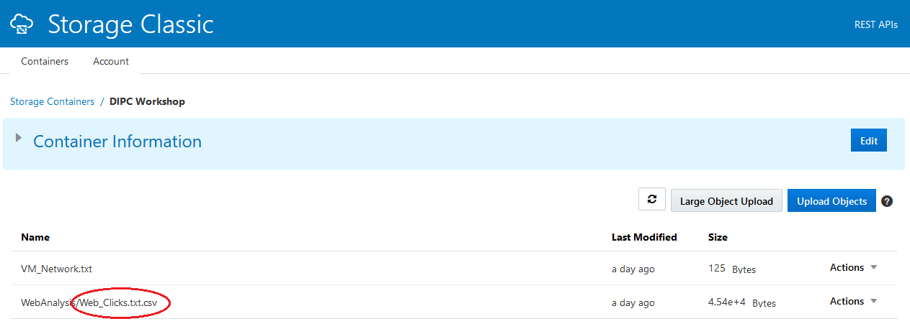
 
2.	You should see your file
 

## Summary
In this lab, we have seen how it is create a data pipeline to object storage; this data can then be used by other application (Big Data, etc.)
