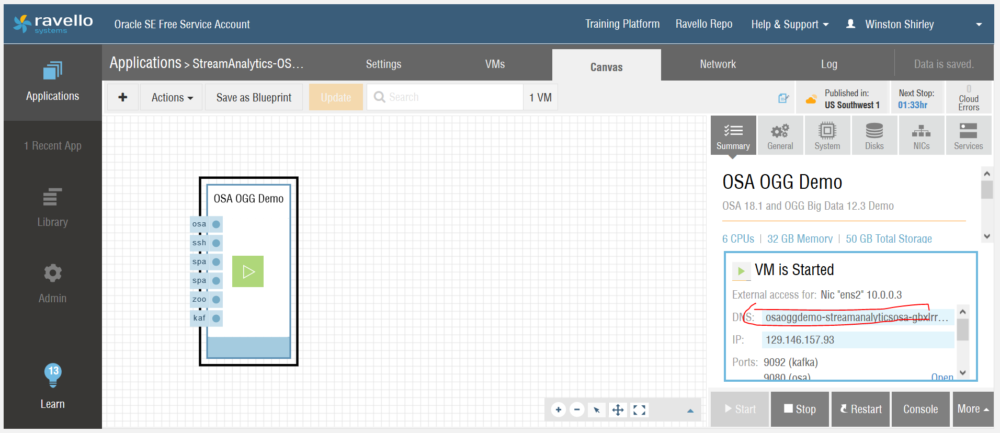

# Lab 900 - Oracle Streams Analytics 

## Start Ravello OSA App and determine instance url

## 1.	Create pipeline
Tag: retail
Stream: Customer Locations

## 2.	Add pattern stage for left outerjoin on customers (enrich customer location data)
Stream: Customers
Correlation: CUSTID = CUSTID
Log into instance (ssh) and start retail stream into Kafka:
$ cd ~/demo
$ retail

## 3.	Add pattern for Spatial -> Geo Fence (visualization)
Malls San Jose
Parameters
Latitude: lat
Longitude: long
Cust id
* View visualization tab

## 4.	Add scoring stage (ML algorithm) 
Model Name: Predict Customer Purchase
Model Version: 2.0
Mapping: CUSTID   FCUSTID

## 5.	Add query filter on probability (identify likely buyers – top 30%)
Probability1 greater than or equal 0.7

## 6.	Add target (send likely buyers offers)
send offer 
(* may call rest endpoint or API)
