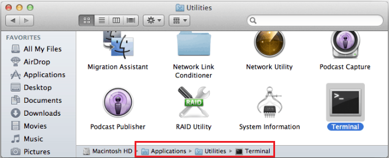
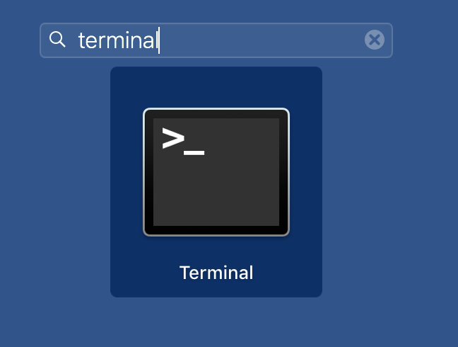
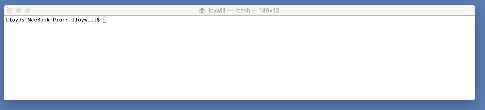
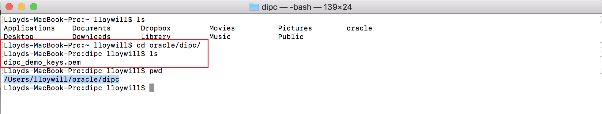
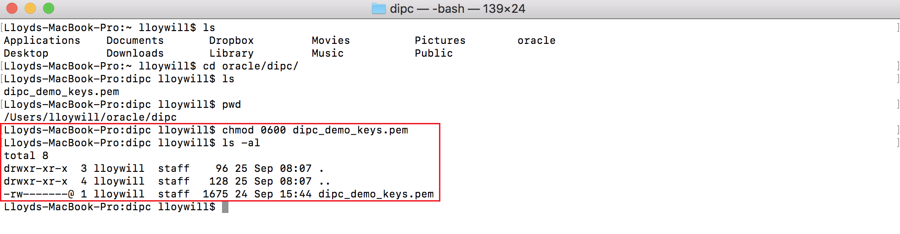
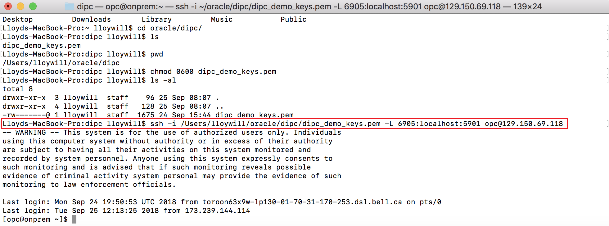

# Appendix 1: SSH Session Configuration

## Windows OS

### Create SSH Configuration

1.	Start PuTTY


 

2.	In the screen provide the following information:
    -  Host: **\<COMPUTE_IP_ADDRESS\>**
    - Saved Session: Provide a name 
```
where:
    <COMPUTE_IP_ADDRESS> - is teh IP address to the server you want to connect (DIPC server, OnPrem server)
```

 
3.	Click on “Save” button
4.	From the hierarchical panel on the left, select “Connection > Data” and provide the following information:
    - Auto-login username: opc


5.	From the hierarchical panel on the left, select “Connection > SSH > Auth”. Click on “Browse”  button to select the private key (PPK) file

 

6.	Navigate to the directory in which you copied the files provided for the labs and select “dipcdemoSSH.ppk”. Click on “Open” button

 

7.	From the hierarchical panel on the left, select “Connection > SSH > Tunnels” and provide the following information:
    - Source port: 6905
    - Destination: **\<COMPUTE_IP_ADDRESS\>**:5901
```
where:
    <COMPUTE_IP_ADDRESS> - is teh IP address to the server you want to connect (DIPC server, OnPrem server)
```
8.	Click on “Add” button

 

9.	From the hierarchical panel on the left, select “Sessions” (on top) and then click on “Save” button. This will save this configuration so you can re-use it.

 

10.	Click on “Open” button to start your SSH session. 

 


## Load Existing Configuration
If you have saved the SSH configuration previously.

1.	Start PuTTY


2.	Select your configuration in the “Saved Sessions” section then click on “Load” button

 

3.	Click on “Open” button to start your SSH session. 
 
 


## Mac OS
### Open Terminal
1. Open your Applications folder
2. Open the Utilities folder
3. Open the Terminal application



or 

1. Open the Launchpad

 

2. Search for "Terminal"

 

3. An empty terminal window should open.




### Key File

1. Copy the key file that the instructor provided into your machine
2. In the terminal window, change to the directory where you copied the key (e.g. cd oracle/dipc/)



3. Change permission to the key file. Execute:

chmod 0600 **\<KEY_FILE\>** 
```
where:
    <KEY_FILE> - is the key file that the instructor provided and you copied to your machine (e.g. chmod 0600 dipc_demo_keys.pem)
```



### Start the SSH session

1. To start the SSH session and open the tunnel, execute:

ssh -i **\<KEY_FILE_PATH\>**/**\<KEY_FILE\>** -L 6905:localhost:5901 opc@**\<COMPUTE_IP_ADDRESS\>**
```
where:

    <KEY_FILE_PATH> - is path to the file you created in the previous section step 3.
    <KEY_FILE> - is the name you assigned to the key file.
    <COMPUTE_IP_ADDRESS> - is the IP address of the server you want to connect (DIPC server, OnPrem server) (e.g. ssh -i /Users/lloywill/oracle/dipc/dipc_demo_keys.pem -L 6905:localhost:5901 opc@129.150.69.118)
```


You will see a warning message from Oracle saying that this system is only for authorized users. You are now connected to your Oracle cloud instance and have established an SSH tunnel to forward your local port 6905 to port 5901 on the cloud instance.