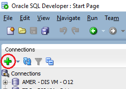
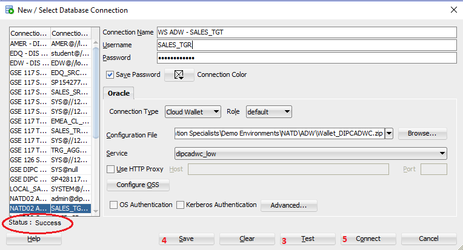

# Appendix 3: SQL Developer

SQL developer can be used to verify data in sources and targets.
1.	Start SQL Developer


2.	Click on plus icon (+) to create a new connection



3.	Provide the following information:
    - Connection Name: WS - SALES_SRC
    - Username: SALES_SRC
    - Password: Welcome#123
    - Save Password: SELECTED
    - Connector Type: Basic
    - Hostname: **<SRC_DB_IP_ADDRESS>**
    - Port: 1521
    - Service Name: **<SRC_DB_SERVICE_NAME>**
 ```
 where:
     <SRC_DB_IP_ADDRESS> - IP Address of the source database server. This have been provided in your environment page; look for entry SOURCE_DB_NAME
     <CDB_SOURCE_SERVICE_NAME> - CDB Service name string for the source database server. This have been provided in your environment page; look for entry CDB_SOURCE_SERVICE_NAME
 ```


4.	Click on “Test” button located on bottom right corner. A “Success” message should appear on the bottom left (just above the “Help” button)


5.	Once the test is successful, click on “Save” to save the connection and re-use in the future
6.	Once the connection is selected, click on “Connect” button to establish the connection

## Additional Connections
You will need to define the following connections:
1. WS - SALES_TRG
>    - Connection Name: WS - SALES_TRG
>    - Username: SALES_TRG 
>    - Password: Welcome#123
>    - Save Password: SELECTED
>    - Connector Type: Basic
>    - Hostname: **<TRG_DB_IP_ADDRESS>**
>    - Port: 1521
>    - Service Name: **<TRG_DB_SERVICE_NAME>**


2. WS - TRG_AGG_SALES
>   - Connection Name: WS - TRG_AGG_SALES
>   - Username: TRG_AGG_SALES
>   - Password: Welcome#123
>   - Save Password: SELECTED
>   - Connector Type: Basic
>   - Hostname: **<TRG_DB_IP_ADDRESS>**
>   - Port: 1521
>   - Service Name: **<TRG_DB_SERVICE_NAME>**


3. WS - EMEA_CL_TRG
>   - Connection Name: WS - EMEA_CL_TRG
>   - Username: EMEA_CL_TRG
>   - Password: Welcome#123
>   - Save Password: SELECTED
>   - Connector Type: Basic
>   - Hostname: **<TRG_DB_IP_ADDRESS>**
>   - Port: 1521
>   - Service Name: **<TRG_DB_SERVICE_NAME>**


4. WS - AMER_SRC
>   - Connection Name: WS - AMER_SRC
>   - Username: AMER_SRC
>   - Password: Welcome#123
>   - Save Password: SELECTED
>   - Connector Type: Basic
>   - Hostname: **<ON_PREM_IP_ADDRESS>**
>   - Port: 1521
>   - Service Name: PDB1


4. WS - EMEA_TRG
>   - Connection Name: WS - EMEA_TRG
>   - Username: EMEA_TRG
>   - Password: Welcome#123
>   - Save Password: SELECTED
>   - Connector Type: Basic
>   - Hostname: **<ON_PREM_IP_ADDRESS>**
>   - Port: 1521
>   - Service Name: PDB1


## Autonomous Data Warehouse 
Connection to ADW is a little different from the regular DB. It requires a wallet that will be provided by your instructor.

1.	Click on plus icon (+) to create a new connection


2.	Provide the following information
>    - Connection Name: WS ADW - SALES_TGT
>    - Username: SALES_TRG
>    - Password: Welcome#123
>    - Save Password: SELECTED
>    - Connector Type: Cloud Wallet
>    - Configuration File: **<ADW_wallet_path>**
>    - Service Name: ***<ADW_service_low>***
```
 where:
     <ADW_wallet_path> - This is the path to the ADW wallet file (zip file)  provided by the instructor
     <ADW_service_low> - The drop down will show all the available services; select th eone with "_low" at the end
 ```
3.	Click on “Test” button located on bottom right corner. A “Success” message should appear on the bottom left (just above the “Help” button)



4.	Once the test is successful, click on “Save” to save the connection and re-use in the future
5.	Once the connection is selected, click on “Connect” button to establish the connection


