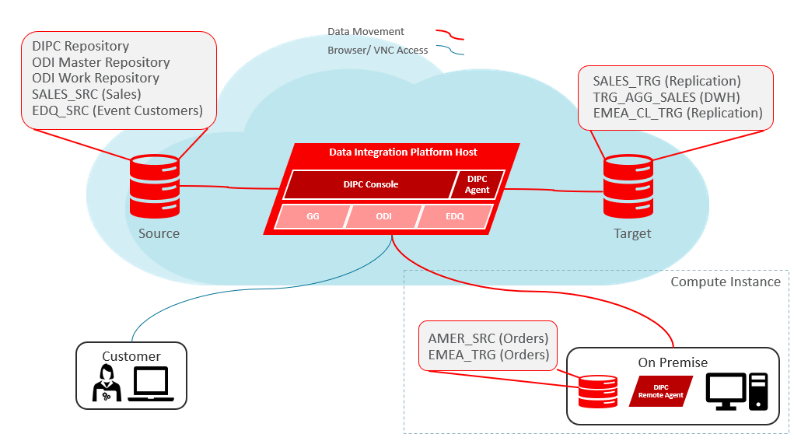

# Data Integration Platform Cloud Workshop

## How to Prepare for This Workshop 
*** Need to change these links ***

- To log issues and view the lab guide source, go to the [github oracle](https://github.com/oracle/learning-library/tree/master/workshops/dbcs-dba) repository.

- The Labguides are best viewed using the workshop's [GitHub Pages Website URL](https://oracle.github.io/learning-library/workshops/dbcs-dba) 

- Once you are viewing the workshop's gitHub page's website, you can see a list of Lab Guides at any time by clicking on the **Menu Icon**

## Oracle Data Integration Platform Cloud (DIPC) Services Workshop

Welcome to the Oracle Data Integration Platform Cloud Service Workshop. The content will give you a basic understanding of Oracle Data Integration Platform Cloud Service and many of the capabilities related to provisioning, elevated tasks, agent install, data preparation and internals.  The labs are as follows:
-  Lab 100 - Provisioning DIPCS
-  Lab 200 - Sync Elevated Task
-  Lab 300 - Remote Agent Install & Sync on-prem database
-  Lab 400 - Migrate on-prem to Cloud
-  Lab 500 - Prepare Data
-  Lab 600 - ODI Execution Task
-  Lab 700 - Under the covers DIPCS
-  Lab 800 - DIPCS integrating with ADWC
-  Lab 900 - MySQL integration
-  Lab 1000 - BigData Integration

## Workshop architecture
 

- Source: DIPC instance
- Target: DIPC Instance
- On-Prem: Cloud Compute Instance that will simulate an On-Prem environment

## Workshop Details

**Reference the following Lab Guides by opening their Documentation Files:**

*** Need to change these links ***

## Lab 100: Provisioning DIPCS

**Documentation**: [CloudWorkshop\_DIPC\_100.md](CloudWorkshop\_DIPC\_100.md)

### Objectives

-   Provision a Data Integration Cloud Service instance.

## Lab 200: Sync Elevated Task

**Documentation**: [CloudWorkshop\_DIPC\_200.md](CloudWorkshop\_DIPC\_200.md)

### Objectives
- Review how to create connections
- Review how to execute a Synchonize Data elevated task

## Lab 300: Remote Agent Install & Sync on-prem databases

**Documentation**: [CloudWorkshop\_DIPC\_300.md](CloudWorkshop\_DIPC\_300.md)

### Objectives
-	Review downloading process, installation and configuration of DIPC remote agent
-   Synchronize two On-Premise Databases

## Lab 400:  Migrate on-prem to Cloud

**Documentation**: [CloudWorkshop\_DIPC\_400.md](CloudWorkshop\_DIPC\_400.md)

### Objectives
-   Review downloading process, installation and configuration of DIPC remote agent
-   Migrate an on-prem database to a database cloud service

## Lab 500:  Prepare Data

**Documentation**: [CloudWorkshop\_DIPC\_500.md](CloudWorkshop\_DIPC\_500.md)

### Objectives
-   Prepare data from flat files
-   Transform data elements
-   Administer transformations

## Lab 600:  ODI Execution Task

**Documentation**: [CloudWorkshop\_DIPC\_600.md](CloudWorkshop\_DIPC\_600.md)

### Objectives
-   Undertsand how to import ODI scenarios
-   Execute and monitor ODI scenarios using DIPC

## Lab 700:  Under the covers DIPCS

**Documentation**: [CloudWorkshop\_DIPC\_700.md](CloudWorkshop\_DIPC\_700.md)

### Objectives
- Demonstrate how to work directly with underneath DIPC GG "engine"
- Demonstrate how to work directly with underneath DIPC ODI "engine"
- Demonstrate how to work directly with underneath DIPC EDQ "engine"
-   Understand underlying DIPC architecture ??
-   Review default Oracle Golden Gate configurations ??
-   Review weblogic components ??
-   Revew required ports for communication between agent and DIPC console ??

## Lab 800:  DIPCS integrating with ADWCS

**Documentation**: [CloudWorkshop\_DIPC\_800.md](CloudWorkshop\_DIPC\_800.md)

### Objectives
- ***

## Lab 900:  MySQL integration

**Documentation**: [CloudWorkshop\_DIPC\_900.md](CloudWorkshop\_DIPC\_900.md)

### Objectives
- ***

## Lab 1000:  BigData Integration

**Documentation**: [CloudWorkshop\_DIPC\_1000.md](CloudWorkshop\_DIPC\_1000.md)

### Objectives
- ***
