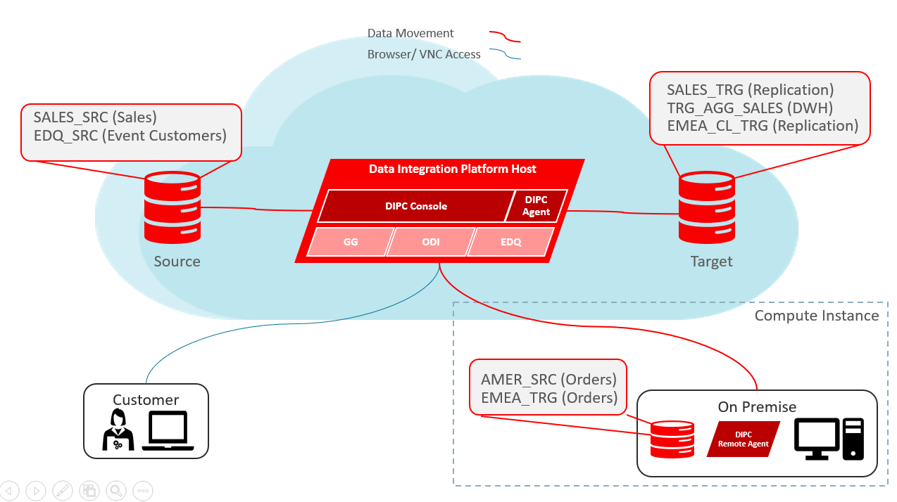

# Data Integration Platform Cloud Workshop - Introduction
Oracle Data Integration Platform Cloud is a cloud-based platform for data transformation, integration, replication, analysis, and governance. 

Data Integration Platform Cloud provides seamless batch and real-time data movement among cloud and on-premises data sources, maintaining data consistency with fault tolerance and resiliency. With Oracle Data Integration Platform Cloud, you can: 

- Connect to data sources and prepare, transform, replicate, analyze, govern, and monitor data
- Analyze data streams to gain actionable business insight
- Set up policies based on metrics to receive notifications
- Manage all your data sources from a single platform

Data Integration Platform Cloud provides a comprehensive cloud-based solution for all of your data integration and governance needs. With Data Integration Platform Cloud, you can synchronize an entire data source or copy high volumes of data in batches to a new Oracle Database Cloud deployment, and then easily access, transform, and cleanse your data from the platform. You can also stream data in real time to new data sources, perform data analysis on streaming data, and keep any number of data sources synchronized. 

In addition to Oracle Database, MySQL and Exadata are among the databases that you can use with Oracle Data Integration Platform Cloud. You can perform homogenous or heterogeneous replication between the following: 

- On-premises to Cloud
- Cloud to Cloud
- Cloud to On-premises
- On-premises to On-premises

There are three editions of Data Integration Platform Cloud so you can select the one that best suits your requirements:

- Standard Edition: For a bulk copy of your data sources to the cloud, or to extract, load and transform your data.
- Enterprise Edition: For a selective copy or real time replication of your data sources, or to extract, load and transform your data.
- Governance Edition: To extract, load, transform, manage, replicate, and Data Quality.

## Prepare for the Workshop
In order to hit the floor running, you woud need the following applications in your laptop:
- PuTTY (https://www.putty.org/)
- VNC Viewer (https://www.realvnc.com/en/connect/download/viewer/)
- SQL Developer v17.3.1 or older (https://www.oracle.com/technetwork/developer-tools/sql-developer/downloads/index.html)

**Note: the URLs provided for 3rd party SW are only a suggestion. PuTTY and VNC Viewer are open source and can be downloaded from many sites**

## DIPC Workshop Environment
Oracle will provide each student with the following environment on the cloud:

 

- DIPC Server
- 2 DBCS instances (Source and Target). DBs environments will be ready to be used (users, schemas, data, etc.) 
- Cloud Compute Instance (On-Prem) that will simulate an On-Prem environment

The Oracle team will provide all the necessary information to access the environment:
- URLs to environment
- Credentials (Users/Passwords)
- Private keys in OpenSSH format for all instances 
- Public IP address for each workshop service instance
